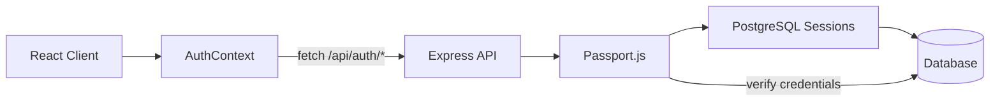

# Architecture Technique - NuageBook

## Vue d'ensemble

NuageBook est une plateforme e-commerce full-stack pour des livres personnalisés avec traitement EPUB/IDML.

**📚 Documentation connexe :**
- **[PRD.md](PRD.md)** - Product Requirements Document complet
- **[ARCHITECTURE_DIAGRAMS.md](ARCHITECTURE_DIAGRAMS.md)** - Diagrammes visuels complets
- **[GUIDE_EPUB_IDML.md](GUIDE_EPUB_IDML.md)** - Guide d'import technique

**🎯 Diagramme Architecture Globale :** Voir [Architecture Globale](ARCHITECTURE_DIAGRAMS.md#1-architecture-globale)

## Stack Technique

### Backend

**Runtime et Framework**
- **Node.js** : 20+ avec TypeScript 5.6.3
- **Express.js** : 4.21.2 - Framework HTTP
- **Compilation** : tsx 4.20.5 pour exécution TypeScript
- **Build** : esbuild 0.25.0 pour bundling production

**Base de Données**
- **PostgreSQL** : Railway PostgreSQL (proxy `rlwy.net`)
- **ORM** : Drizzle ORM 0.39.1 avec drizzle-kit 0.31.4
- **Migrations** : Gérées via drizzle-kit
- **Session Store** : connect-pg-simple 10.0.0 avec express-session 1.18.1

**Validation et Types**
- **Zod** : 3.25.76 - Validation runtime et génération types
- **drizzle-zod** : 0.7.0 - Bridge ORM ↔ validation
- **zod-validation-error** : 3.4.0 - Messages d'erreur lisibles

**Logging**
- **Pino** : 8.21.0 - Logger structuré JSON
- **pino-pretty** : 10.3.1 - Pretty printing en développement

**Paiements**
- **Stripe** : 20.0.0 - SDK Stripe officiel
- **stripe-sync** : 1.0.0 - Synchronisation webhooks → DB

**Rendu Serveur**
- **Playwright** : playwright-core 1.40.0 - Automatisation Chromium
- **Sharp** : 0.34.5 - Traitement images
- **html2canvas** : 1.4.1 - Rendu HTML → Canvas

**Parsing EPUB/IDML**
- **JSZip** : 3.10.1 - Décompression archives
- **Cheerio** : 1.1.2 - Parsing HTML/XHTML
- **fast-xml-parser** : 5.3.3 - Parsing XML IDML
- **ag-psd** : 29.0.0 - Parsing fichiers PSD

**Sécurité et Authentification**
- **express-rate-limit** : 7.1.5 - Rate limiting
- **Passport** : 0.7.0 - Framework d'authentification
- **passport-local** : 1.0.0 - Stratégie email/password
- **bcryptjs** : Latest - Hash passwords (10 rounds)
- **express-session** : 1.18.1 - Gestion sessions
- **connect-pg-simple** : 10.0.0 - Session store PostgreSQL

**Utilitaires**
- **compression** : 1.7.4 - Compression gzip
- **google-auth-library** : 10.5.0 - Auth Google Cloud
- **@google-cloud/storage** : 7.18.0 - Object Storage
- **memorystore** : 1.6.7 - Session store mémoire (dev)
- **p-queue** : 9.0.1 - Queue gestion concurrence

### Frontend

**Framework et Routing**
- **React** : 19.2.0 avec react-dom 19.2.0
- **Wouter** : 3.3.5 - Router léger (alternative React Router)
- **TypeScript** : 5.6.3 strict mode

**Build et Développement**
- **Vite** : 7.1.9 - Build tool ultra-rapide
- **@vitejs/plugin-react** : 5.0.4 - Support React HMR
- **PostCSS** : 8.5.6 avec autoprefixer 10.4.21

**State Management**
- **TanStack Query** : 5.60.5 (react-query) - Cache serveur
- **Context API** : BooksContext, CartContext, MenuContext
- **localStorage** : Persistance panier

**UI et Composants**
- **Radix UI** : 40+ composants (@radix-ui/react-*)
  - Dialog, Dropdown, Select, Toast, Tabs, etc.
  - Accessibles ARIA, keyboard navigation
- **Tailwind CSS** : 4.1.14 avec @tailwindcss/vite 4.1.14
- **tailwindcss-animate** : 1.0.7 - Animations
- **Lucide React** : 0.545.0 - Icônes (6000+ icônes)
- **class-variance-authority** : 0.7.1 - Gestion variants CSS
- **tailwind-merge** : 3.3.1 - Merge classes Tailwind

**Formulaires et Validation**
- **react-hook-form** : 7.66.0 - Gestion formulaires
- **@hookform/resolvers** : 3.10.0 - Bridge avec Zod
- **input-otp** : 1.4.2 - Input codes OTP

**Visualisation Données**
- **Recharts** : 2.15.4 - Graphiques admin dashboard
- **react-day-picker** : 9.11.1 - Sélecteur dates

**Animations et Interactions**
- **Framer Motion** : 12.23.24 - Animations avancées
- **flipbook-js** : 1.1.1 - Effet page tournante
- **embla-carousel-react** : 8.6.0 - Carrousels
- **@dnd-kit** : 6.3.1 - Drag & drop

**Upload Fichiers**
- **Uppy** : 5.x - Upload manager
  - @uppy/core, @uppy/dashboard, @uppy/react, @uppy/aws-s3

**Utilitaires**
- **date-fns** : 3.6.0 - Manipulation dates
- **sonner** : 2.0.7 - Toast notifications
- **cmdk** : 1.1.1 - Command palette
- **next-themes** : 0.4.6 - Gestion thème dark/light
- **react-resizable-panels** : 2.1.9 - Panels redimensionnables
- **vaul** : 1.1.2 - Drawer mobile

### Tests

**Framework et Outils**
- **Vitest** : 1.2.0 - Test runner compatible Vite
- **@vitest/ui** : 1.2.0 - Interface web tests
- **@vitest/coverage-v8** : 1.2.0 - Coverage V8
- **Supertest** : 6.3.4 - Tests HTTP

### DevOps et CI/CD

**Pre-commit**
- **Husky** : 8.0.3 - Git hooks
- **lint-staged** : 15.2.0 - Lint sur fichiers staged
- **TypeScript check** : Sur fichiers modifiés

**GitHub Actions**
- Type checking (tsc)
- Tests (Vitest)
- Build production
- Upload coverage

**Monitoring**
- Logs structurés Pino (JSON)
- Health checks : /health, /health/ready, /health/live

## Structure du Projet

```
/
├── client/               # Application React
│   ├── src/
│   │   ├── components/   # Composants UI
│   │   ├── context/      # Context providers
│   │   ├── hooks/        # Custom hooks
│   │   ├── pages/        # Pages
│   │   └── utils/        # Utilitaires
│
├── server/               # Application Express
│   ├── config/           # Configuration
│   │   ├── env.ts        # Variables environnement
│   │   └── passport.ts   # Configuration Passport.js (NEW)
│   ├── middleware/       # Middlewares Express
│   │   ├── auth.ts       # requireAuth, optionalAuth (NEW)
│   │   ├── error-handler.ts
│   │   ├── rate-limit.ts
│   │   └── validation.ts
│   ├── routes/           # Routes modulaires
│   │   ├── auth.routes.ts    # Authentification (NEW)
│   │   ├── books.routes.ts
│   │   ├── customers.routes.ts  # + routes /me (NEW)
│   │   ├── orders.routes.ts     # + route /my-orders (NEW)
│   │   ├── checkout.routes.ts
│   │   ├── health.routes.ts
│   │   └── index.ts
│   ├── scripts/          # Scripts utilitaires
│   │   └── clean-old-customers.ts  # Migration données (NEW)
│   ├── types/            # Types TypeScript
│   │   └── express.d.ts  # Extension req.user (NEW)
│   ├── utils/            # Utilitaires
│   │   ├── errors.ts     # Classes d'erreurs
│   │   ├── logger.ts     # Logger structuré
│   │   └── path-validator.ts
│   ├── db.ts             # Configuration DB
│   ├── storage.ts        # Couche d'accès aux données (password exclusion)
│   └── index.ts          # Point d'entrée (session middleware)
│
├── shared/               # Code partagé
│   └── schema.ts         # Schémas Drizzle et Zod
│
└── .github/
    └── workflows/        # CI/CD
        └── ci.yml
```

## Principes d'Architecture

### 1. Type Safety

- **Zero `any`**: Tout le code applicatif est strictement typé
- **Validation Zod**: Toutes les entrées utilisateur sont validées
- **Types partagés**: Les types sont partagés entre client et serveur via `@shared`

### 2. Gestion d'Erreurs

Hiérarchie des erreurs personnalisées:
- `AppError`: Classe de base
- `NotFoundError`: Ressource non trouvée (404)
- `ValidationError`: Données invalides (400)
- `UnauthorizedError`: Non autorisé (401)
- `ForbiddenError`: Interdit (403)
- `DatabaseError`: Erreur DB (500)

Middleware centralisé dans `error-handler.ts` qui:
- Gère les erreurs Zod automatiquement
- Log toutes les erreurs avec contexte
- Masque les détails en production

### 3. Logging Structuré

Utilisation de Pino pour un logging structuré avec:
- Niveaux de log: debug, info, warn, error
- Contexte enrichi (userId, requestId, etc.)
- Format JSON en production
- Pretty print en développement

### 4. Sécurité

**🔒 Diagramme détaillé :** [Sécurité et Rate Limiting](ARCHITECTURE_DIAGRAMS.md#10-sécurité-et-rate-limiting)

#### Rate Limiting (express-rate-limit)

**4 niveaux de protection :**

```typescript
// 1. API Générale (apiLimiter)
windowMs: 15 * 60 * 1000  // 15 minutes
max: 100                  // 100 requêtes
message: "Trop de requêtes, réessayez dans 15 minutes"

// 2. Upload (uploadLimiter)
windowMs: 15 * 60 * 1000
max: 10                   // 10 uploads seulement
message: "Limite d'upload atteinte"

// 3. Render (renderLimiter)
windowMs: 15 * 60 * 1000
max: 50                   // 50 rendus
message: "Limite de rendu atteinte"

// 4. Strict (strictLimiter)
windowMs: 15 * 60 * 1000
max: 20                   // 20 requêtes sensibles
message: "Limite stricte atteinte"
```

**Application par route :**
- `/api/*` → apiLimiter
- `/api/books/import-storyboard` → uploadLimiter
- `/api/books/:id/render-pages` → renderLimiter
- `/api/admin/*` → strictLimiter

#### Validation (Zod)

**Middleware centralisé** (`middleware/validation.ts`) :
```typescript
validate(schema: ZodSchema) {
  return async (req, res, next) => {
    const result = schema.safeParse(req.body);
    if (!result.success) {
      throw new ValidationError(fromZodError(result.error).message);
    }
    req.body = result.data;
    next();
  };
}
```

**Schémas partagés** (`shared/schema.ts`) :
- insertBookSchema
- insertOrderSchema
- insertCustomerSchema
- wizardConfigSchema
- contentConfigSchema
- bookConfigurationSchema

**Protection injection SQL** :
- Drizzle ORM utilise parameterized queries
- Jamais de concaténation SQL brute
- Validation types TypeScript

#### Path Traversal Protection

**Module** : `utils/path-validator.ts`

```typescript
validatePath(userPath: string, allowedDir: string): boolean {
  const resolved = path.resolve(allowedDir, userPath);
  const normalized = path.normalize(resolved);
  return normalized.startsWith(path.resolve(allowedDir));
}
```

**Application :**
- Upload fichiers (EPUB, IDML, fonts)
- Lecture assets
- Accès Object Storage

#### Authentication (Passport.js)

**Stratégie** : Local (username + password)

**Sessions** :
- express-session avec store PostgreSQL (connect-pg-simple)
- Cookie sécurisé : httpOnly, secure (production)
- Expiration : 24h par défaut

#### Paiements (Stripe)

**Sécurité PCI-compliant** :
- Jamais de stockage numéros CB
- Stripe.js gère tokenization
- Webhooks avec signature verification

#### Variables d'Environnement

**Validation au démarrage** (`config/env.ts`) :
- NODE_ENV, PORT, DATABASE_URL, STRIPE_SECRET_KEY, LOG_LEVEL
- Échec démarrage si config invalide

### 5. Routes Modulaires

Les routes sont organisées par domaine métier:
- `books.routes.ts`: CRUD livres
- `customers.routes.ts`: CRUD clients
- `orders.routes.ts`: CRUD commandes
- `checkout.routes.ts`: Paiement Stripe
- `health.routes.ts`: Monitoring

Chaque module:
- Gère ses propres erreurs
- Log ses opérations
- Utilise le storage layer

### 6. Performance

**Optimisations Backend :**
- **Compression gzip** : Toutes réponses API (compression middleware)
- **Connection Pooling** : PostgreSQL connections réutilisées
- **Browser Pool** : Instance Chromium réutilisée (pas relancée à chaque rendu)
- **Object Pooling** : Réutilisation objets lourds (pages Playwright)
- **Stream Processing** : Fichiers volumineux traités en streams

**Optimisations Frontend :**
- **Code Splitting** : Lazy loading routes avec React.lazy()
- **Image Lazy Loading** : Images chargées au scroll
- **TanStack Query Cache** : Données API mises en cache
  - staleTime: 5 minutes
  - cacheTime: 10 minutes
- **localStorage** : Panier persisté (pas de rechargement serveur)
- **Debounce** : Inputs recherche/filtrage (300ms)

**Headers Cache :**
- Assets statiques : `Cache-Control: public, max-age=31536000, immutable`
- API : `Cache-Control: no-store` (données dynamiques)
- Images générées : `Cache-Control: public, max-age=604800` (7 jours)

**Métriques Objectifs :**
- First Contentful Paint : < 1s
- Time to Interactive : < 3s
- API p95 : < 200ms
- Rendu Canvas : < 500ms/page
- Rendu Playwright : < 2s/page

### 7. State Management Frontend

**🔄 Diagramme détaillé :** [State Management](ARCHITECTURE_DIAGRAMS.md#8-state-management)

#### Architecture Multi-Niveaux

**1. Context API (Global State)**

```typescript
// BooksContext - Catalogue livres
const BooksContext = React.createContext<BooksContextType>();
- books: Book[]
- loading: boolean
- error: Error | null
- refreshBooks: () => Promise<void>

// CartContext - Panier utilisateur
const CartContext = React.createContext<CartContextType>();
- items: CartItem[]
- total: number
- addToCart: (item) => void
- removeFromCart: (id) => void
- updateItem: (id, updates) => void
- clearCart: () => void

// MenuContext - Menus navigation
const MenuContext = React.createContext<MenuContextType>();
- menus: Menu[]
- activeMenu: string

// EcommerceContext - Configuration globale
const EcommerceContext = React.createContext<EcommerceContextType>();
- currency: string
- shippingZones: ShippingZone[]
- settings: Settings
```

**2. AuthContext (Authentification Client - NOUVEAU)**

```typescript
// Context d'authentification global
const AuthContext = React.createContext<AuthContextType>();

interface AuthContextType {
  user: Customer | null;
  isLoading: boolean;
  isAuthenticated: boolean;
  login: (email: string, password: string) => Promise<void>;
  signup: (data: SignupData) => Promise<void>;
  logout: () => Promise<void>;
  setPassword: (email: string, password: string) => Promise<void>;
  forgotPassword: (email: string) => Promise<void>;
  resetPassword: (token: string, password: string) => Promise<void>;
  refreshUser: () => Promise<void>;
}

// État persisté via sessions PostgreSQL (connect-pg-simple)
// Pas de stockage local - session serveur uniquement
```

**3. TanStack Query (Server State Cache)**

```typescript
// Queries
useQuery(['books'], fetchBooks, { staleTime: 5 * 60 * 1000 })
useQuery(['book', id], () => fetchBook(id))
useQuery(['orders'], fetchOrders)

// Mutations
useMutation(createOrder, {
  onSuccess: () => queryClient.invalidateQueries(['orders'])
})
useMutation(updateBook)
```

**3. Local Component State (useState)**
- Formulaires : react-hook-form
- UI temporaire : modals, dropdowns, loading
- Wizard : selections en cours

**4. Persistence (localStorage)**
- Panier complet (CartContext)
- Progression wizard (au cas où)
- Préférences UI (thème, langue future)

**Flux de Données :**
```
User Action 
  → Local State (useState)
  → Context (if global)
  → API Call (TanStack Query mutation)
  → Server Response
  → Cache Update (TanStack Query)
  → Context Update
  → localStorage (if needed)
  → Re-render Components
```

## Endpoints Principaux

### Health Check
- `GET /health` - Status complet
- `GET /health/ready` - Readiness probe
- `GET /health/live` - Liveness probe

### API Publique
- `GET /api/books` - Liste des livres
- `GET /api/books/:id` - Détail livre
- `POST /api/checkout/create-session` - Créer session Stripe
- `POST /api/checkout/verify-payment` - Vérifier paiement

### API Authentification (NOUVEAU v1.1)
- `POST /api/auth/signup` - Inscription client
- `POST /api/auth/login` - Connexion
- `POST /api/auth/logout` - Déconnexion
- `GET /api/auth/me` - Session actuelle
- `POST /api/auth/set-password` - Créer password post-achat
- `POST /api/auth/forgot-password` - Demander reset
- `POST /api/auth/reset-password` - Reset avec token

### API Client Protégée (NOUVEAU v1.1)
- `GET /api/customers/me` - Profil client connecté
- `PATCH /api/customers/me` - Mettre à jour profil
- `GET /api/orders/my-orders` - Commandes du client

### API Admin
- `POST /api/books` - Créer livre
- `PATCH /api/books/:id` - Modifier livre
- `POST /api/books/import-storyboard` - Import EPUB/IDML
- `POST /api/books/:id/render-pages` - Rendu serveur
- `GET /api/orders` - Liste toutes commandes
- `GET /api/customers` - Liste tous clients

## Flux Métier Détaillés

**📊 Diagrammes complets :** Voir [ARCHITECTURE_DIAGRAMS.md](ARCHITECTURE_DIAGRAMS.md)

### 1. Flux Import EPUB/IDML

**Objectif :** Transformer un storyboard InDesign en livre personnalisable

**Acteur :** Administrateur

**Étapes :**

1. **Préparation InDesign**
   - Designer crée storyboard avec variables `{{nom_enfant}}`, `{{age}}`, etc.
   - Applique styles (Character/Paragraph) à tous les textes
   - Export EPUB (Fixed Layout) + IDML

2. **Upload Interface Admin**
   ```
   POST /api/books/import-storyboard
   FormData: epub, idml, fonts[], bookId
   ```

3. **Extraction EPUB** (`epubExtractor.ts`)
   - Décompression ZIP
   - Extraction images → Object Storage
   - Parsing CSS pour positions (x, y, width, height, rotation)
   - Création conteneurs VIDES avec positions uniquement
   - ⚠️ **Important** : L'EPUB ne contient AUCUN texte ni police

4. **Parsing IDML** (`idmlParser.ts`)
   - Décompression ZIP
   - Parsing `Stories.xml` → textFrames avec contenu complet
   - Parsing `Graphic.xml` → CharacterStyles, ParagraphStyles, couleurs
   - Conversion CMYK/RGB → Hex
   - ✅ **Source unique** de tout le texte et la mise en forme

5. **Fusion** (`idmlMerger.ts`)
   - Mapping automatique 1-à-1 (ordre de lecture)
   - Résolution fontFamily : inline > charStyle > paraStyle
   - Application styles complets
   - Détection variables

6. **Génération Wizard** (`wizardConfigBuilder.ts`)
   - Analyse noms fichiers : `page1_hero-father_skin-light.png`
   - Extraction caractéristiques : hero, skin, hair, etc.
   - Génération tabs/variants/options
   - Labels français automatiques

7. **Stockage**
   - Sauvegarde DB : wizardConfig + contentConfig
   - Upload assets → Object Storage

**⏱️ Durée typique :** 20-30s pour livre 24 pages

**🎯 Diagramme détaillé :** [Flux Import EPUB/IDML](ARCHITECTURE_DIAGRAMS.md#2-flux-import-epubidml)

---

### 2. Flux Personnalisation Utilisateur

**Objectif :** Créer un livre personnalisé avec preview temps réel

**Acteur :** Utilisateur final

**Étapes :**

1. **Découverte**
   - Navigation catalogue par catégorie
   - Sélection livre
   - Clic "Personnaliser"

2. **Wizard Multi-Étapes**
   - **Chargement** : GET /api/books/:id → récupération wizardConfig
   - **Génération UI** : Tabs et variants créés dynamiquement
   - **Étape 1 - Héros** : Genre, teint, cheveux, yeux
   - **Étape 2 - Co-héros** : Parents, frère/sœur, animaux
   - **Étape 3 - Détails** : Nom enfant, âge, dédicace
   - **Navigation** : Validation à chaque étape

3. **Preview Temps Réel**
   - À chaque changement → `generateBookPages(config)`
   - Filtrage images selon conditions
   - Résolution variables texte (`{TXTVAR_*}`, `{{childName}}`, `[childName]`)
   - Rendu Canvas (client-side) avec fidélité InDesign (fonts custom, positions EPUB, lineHeight pt)
   - Affichage Flipbook (desktop) ou Single-page (mobile)
   - Dédicace : fallback client dans `handleApplyChanges` si serveur Playwright indisponible

4. **Validation et Ajout Panier**
   - Review final toutes pages
   - Clic "Ajouter au panier"
   - Sauvegarde CartContext + localStorage

**⏱️ Durée typique :** 3-5 minutes

**🎯 Diagramme détaillé :** [Flux Personnalisation](ARCHITECTURE_DIAGRAMS.md#3-flux-personnalisation-utilisateur)

---

### 3. Flux Checkout et Paiement

**Objectif :** Finaliser commande avec paiement sécurisé

**Acteur :** Utilisateur final

**Étapes :**

1. **Panier**
   - Review items
   - Modification quantité/format
   - Clic "Commander"

2. **Informations Client**
   - Formulaire : email, nom, adresse
   - Validation côté client (Zod)

3. **Calcul Livraison**
   - GET /api/shipping/calculate
   - Affichage options et prix
   - Sélection méthode

4. **Création Session Stripe**
   ```javascript
   POST /api/checkout/create-session
   → DB: Create order (status: pending)
   → Stripe: Create checkout session
   → Response: session.url
   ```

5. **Paiement Stripe**
   - Redirection Stripe Checkout
   - Saisie CB / Google Pay / Apple Pay
   - 3D Secure si nécessaire

6. **Webhook Confirmation**
   ```javascript
   POST /api/stripe/webhook
   Event: checkout.session.completed
   → DB: Update order (status: paid)
   → Email: Send confirmation
   ```

7. **Page Succès**
   - GET /checkout/success?session_id=xxx
   - POST /api/checkout/verify-payment
   - Affichage récapitulatif commande

**⏱️ Durée typique :** 2-3 minutes

**🎯 Diagramme détaillé :** [Flux Checkout](ARCHITECTURE_DIAGRAMS.md#4-flux-checkout-et-paiement)

---

### 4. Flux Gestion Commande (Admin)

**Objectif :** Traiter et expédier commandes

**Acteur :** Administrateur

**Étapes :**

1. **Dashboard**
   - Visualisation commandes du jour
   - Filtrage par statut : pending, paid, processing, shipped

2. **Détail Commande**
   - GET /api/orders/:id
   - Affichage : items, config personnalisation, adresse
   - Preview pages générées

3. **Export Impression**
   - POST /api/books/:id/render-pages (Playwright)
   - Génération haute qualité
   - Téléchargement PDF ou envoi imprimeur

4. **Marquage Expédiée**
   - PATCH /api/orders/:id
   - Update status: shipped
   - Ajout numéro tracking
   - Email automatique client

**⏱️ Durée typique :** 5-10 minutes par commande

---

### 5. Flux Rendu Pages

**Deux modes disponibles :**

#### Mode Client (Preview)
- **Technologie** : HTML5 Canvas API
- **Usage** : Preview rapide dans wizard + fallback si rendu serveur échoue
- **Process** :
  1. Charger fonts custom via `FontFace API` depuis `/assets/books/{id}/font/` (avec cache statique)
  2. Créer canvas aux dimensions de la page EPUB (`contentConfig.pages[0]`) × 4 (haute résolution)
  3. Dessiner images filtrées (positions en px EPUB → canvas via ratio)
  4. Dessiner textes avec styles IDML complets :
     - `fontScale = (96/72) × 4` pour conversion pt→px canvas
     - `lineHeight = pt × 4 × ratio` (basé sur pt, pas fontScale, pour fidélité InDesign)
     - `topOffset` basé sur `actualBoundingBoxAscent` pour éviter rognage des ascendantes
     - Clip de zone avec marge supérieure pour les ascendantes/accents
     - Résolution variables `{TXTVAR_*}` dans les deux renderers (segments et classique)
     - `strokeColor/strokeWeight/horizontalScale` hérités du `globalStyle`
  5. Export DataURL JPEG
- **Performance** : ~500ms par page
- **Priorité** : Priorité 3 (après pages pré-rendues EPUB et rendu serveur Playwright)

#### Mode Serveur (Production)
- **Technologie** : Playwright + Chromium
- **Usage** : Export final haute qualité
- **Process** :
  1. Acquérir browser depuis pool
  2. Créer page HTML complète
  3. Injecter CSS + fonts (Data URI)
  4. Screenshot haute résolution
  5. Upload Object Storage
- **Performance** : ~2s par page

**🎯 Diagramme détaillé :** [Flux Rendu Pages](ARCHITECTURE_DIAGRAMS.md#9-flux-rendu-pages)

---

## Base de Données

**🗄️ Diagramme ERD complet :** [Modèle de Données](ARCHITECTURE_DIAGRAMS.md#7-modèle-de-données-erd)

### Tables Principales
- `books`: Livres avec `wizardConfig` et `contentConfig`
- `customers`: Clients
- `orders`: Commandes avec items et statut paiement
- `shipping_zones`: Zones d'expédition
- `printers`: Imprimeurs
- `menus`: Menus du site
- `settings`: Paramètres

### Types JSON Stricts
- `WizardConfig`: Configuration du wizard de personnalisation
- `ContentConfig`: Configuration du contenu (pages, images, textes)
- `BookConfiguration`: Sélections utilisateur

## Tests

### Configuration
- **Framework**: Vitest
- **Coverage**: V8
- **Tests**: `npm test`
- **UI**: `npm run test:ui`

### Structure
```
__tests__/
├── utils/
│   └── errors.test.ts
└── routes/
    └── books.test.ts
```

## CI/CD

### GitHub Actions
- Type checking avec `tsc`
- Tests avec Vitest
- Build de production
- Upload de coverage

### Pre-commit Hooks
- Husky + lint-staged
- Type checking sur fichiers modifiés

## Monitoring

### Health Checks
- Database connectivity
- Uptime tracking
- Environment info

### Logs
- Logs structurés avec contexte
- Niveaux appropriés
- Rotation automatique (production)

## Variables d'Environnement

Toutes validées au démarrage via `server/config/env.ts`:

```typescript
// Requis
NODE_ENV=development|production|test
PORT=5000
DATABASE_URL=postgresql://...
SESSION_SECRET=string (min 32 chars) // NOUVEAU - Obligatoire pour auth

// Optionnel
STRIPE_SECRET_KEY=sk_...
STRIPE_PUBLISHABLE_KEY=pk_...
LOG_LEVEL=debug|info|warn|error
R2_ENDPOINT=https://your-account-id.r2.cloudflarestorage.com
STRIPE_SYNC_BACKFILL=true|false
```

**⚠️ Nouveauté v1.1:** `SESSION_SECRET` est maintenant obligatoire avec une valeur par défaut en développement. En production, définir une valeur forte générée aléatoirement.

## Système d'Authentification Client (v1.1)

### Vue d'ensemble

Système complet d'authentification basé sur **Passport.js + express-session** avec sessions PostgreSQL.

**📖 Documentation complète:** [AUTHENTICATION_SYSTEM.md](AUTHENTICATION_SYSTEM.md)

### Architecture



### Stack Authentification

- **Passport.js** - Framework d'authentification modulaire
- **LocalStrategy** - Authentification email/password
- **bcryptjs** - Hash passwords (10 rounds, salt automatique)
- **express-session** - Gestion sessions HTTP
- **connect-pg-simple** - Stockage sessions PostgreSQL
- **crypto** - Génération tokens reset password

### Schéma Base de Données

```typescript
// Table customers - Nouveaux champs v1.1
{
  id: varchar (PK)
  email: text (unique)
  firstName: text
  lastName: text
  phone: text (nullable)
  address: jsonb (nullable)
  totalSpent: decimal
  orderCount: integer
  notes: text (nullable)
  createdAt: timestamp
  
  // NOUVEAU - Authentification
  password: text (nullable)               // Hash bcrypt
  resetPasswordToken: text (nullable)     // Token temporaire
  resetPasswordExpires: timestamp (nullable) // Expiration 1h
}

// Table session (créée automatiquement)
{
  sid: varchar (PK)
  sess: json
  expire: timestamp
}
```

### Routes d'Authentification

| Route | Méthode | Protection | Description |
|-------|---------|-----------|-------------|
| `/api/auth/signup` | POST | Publique | Inscription nouveau client |
| `/api/auth/login` | POST | Publique + Rate limit | Connexion email/password |
| `/api/auth/logout` | POST | - | Déconnexion + destroy session |
| `/api/auth/me` | GET | - | Récupérer utilisateur connecté |
| `/api/auth/set-password` | POST | Publique + Rate limit | Définir password post-achat |
| `/api/auth/forgot-password` | POST | Publique + Rate limit | Demander reset (email) |
| `/api/auth/reset-password` | POST | Publique + Rate limit | Reset avec token |

### Middleware d'Authentification

```typescript
// server/middleware/auth.ts

// Protège une route - retourne 401 si non authentifié
export function requireAuth(req, res, next)

// Optionnel - attache req.user si connecté
export function optionalAuth(req, res, next)
```

### Sécurité

**Passwords:**
- Jamais stockés en clair (hash bcrypt)
- Jamais retournés via API (exclus des selects)
- Validation minimum 8 caractères

**Sessions:**
- Stockées en PostgreSQL (pas de mémoire)
- Cookie httpOnly + sameSite: lax
- Expiration 30 jours
- Secure en production uniquement

**Reset Password:**
- Token aléatoire 32 bytes (crypto.randomBytes)
- Expiration 1 heure
- Message générique (ne révèle pas si email existe)

**Rate Limiting:**
- Toutes les routes auth utilisent `strictLimiter`
- Protection contre brute force

### Meilleures Pratiques E-commerce Appliquées

**Basé sur recherche 2025-2026:**

1. **Guest Checkout** ✅
   - 19% des acheteurs abandonnent si compte obligatoire
   - Solution: Checkout sans compte maintenu

2. **Post-Purchase Account Creation** ✅
   - Meilleure conversion que pré-achat
   - Solution: Formulaire sur CheckoutSuccessPage

3. **Communication de Valeur** ✅
   - 57% des sites n'expliquent pas les bénéfices
   - Solution: Messages clairs ("Suivez vos commandes", "Checkout plus rapide")

4. **Self-Service** ✅
   - 7% ne reviennent jamais après mauvaise UX
   - Solution: Interface simple et intuitive

### Parcours Client Type

```
Visiteur non connecté
  ↓
Parcourt catalogue → Personnalise livre → Ajoute au panier
  ↓
Checkout GUEST (sans compte) ← Peut se connecter si compte existe
  ↓
Paiement Stripe
  ↓
Page Confirmation
  ↓
[BEST PRACTICE] Proposition: "Créer un compte" (email déjà connu)
  ↓
Définit password en 1 clic
  ↓
CLIENT AUTHENTIFIÉ
  ↓
Prochains achats: Checkout pré-rempli + historique commandes
```

## Flux de Données EPUB/IDML

1. **Upload**: EPUB + IDML via object storage
2. **Parsing**: Extraction des textes (IDML) et positions (EPUB)
3. **Merge**: Fusion dans `contentConfig`
4. **Render**: Génération HTML avec Playwright
5. **Storage**: Images rendues dans object storage

## Déploiement

### Production
```bash
npm run build
npm start
```

### Développement
```bash
npm run dev        # Backend
npm run dev:client # Frontend (port 5000)
```

## Best Practices

1. **Toujours valider** les entrées utilisateur avec Zod
2. **Toujours logger** les erreurs avec contexte
3. **Toujours typer** avec TypeScript strict
4. **Jamais exposer** les détails d'erreur en production
5. **Toujours tester** les nouvelles fonctionnalités

## Améliorations Futures

- [ ] Cache Redis pour les livres
- [ ] Métriques Prometheus
- [ ] Documentation Swagger/OpenAPI
- [ ] Tests d'intégration E2E
- [ ] Extraction du service PageRenderer
- [ ] Intégration API imprimeur automatique
- [ ] Webhooks pour événements custom
- [ ] GraphQL API (alternative REST)
- [ ] WebSocket pour preview temps réel collaboratif

---

## Ressources Complémentaires

### Documentation Produit
- **[PRD.md](PRD.md)** - Product Requirements Document
  - Vision et objectifs business
  - Fonctionnalités détaillées
  - User stories
  - Roadmap produit

### Documentation Technique
- **[ARCHITECTURE_DIAGRAMS.md](ARCHITECTURE_DIAGRAMS.md)** - Diagrammes visuels
  - Architecture globale
  - Flux métier détaillés
  - Modèle de données ERD
  - Sécurité et performance

- **[GUIDE_EPUB_IDML.md](GUIDE_EPUB_IDML.md)** - Guide import
  - Règle d'or EPUB vs IDML
  - Architecture fusion
  - Guide polices
  - FAQ et débogage

### Code Source
- **`/client`** - Application React frontend
- **`/server`** - Application Express backend
- **`/shared`** - Schémas partagés (Drizzle + Zod)

### Configuration
- **`vite.config.ts`** - Configuration build Vite
- **`tsconfig.json`** - Configuration TypeScript
- **`drizzle.config.ts`** - Configuration ORM
- **`.github/workflows/ci.yml`** - CI/CD GitHub Actions

---

**Dernière mise à jour :** Janvier 2026  
**Version :** 2.0 (enrichie avec diagrammes et flux métier)
