# Diagrammes d'Architecture - NuageBook

Ce document contient tous les diagrammes d'architecture du système NuageBook.

---

## Table des Matières

1. [Architecture Globale](#1-architecture-globale)
2. [Flux Import EPUB/IDML](#2-flux-import-epubidml)
3. [Flux Personnalisation Utilisateur](#3-flux-personnalisation-utilisateur)
4. [Flux Checkout et Paiement](#4-flux-checkout-et-paiement)
5. [Architecture Frontend](#5-architecture-frontend)
6. [Architecture Backend](#6-architecture-backend)
7. [Modèle de Données (ERD)](#7-modèle-de-données-erd)
8. [State Management](#8-state-management)
9. [Flux Rendu Pages](#9-flux-rendu-pages)
10. [Sécurité et Rate Limiting](#10-sécurité-et-rate-limiting)

---

## 1. Architecture Globale

### Vue d'ensemble du système

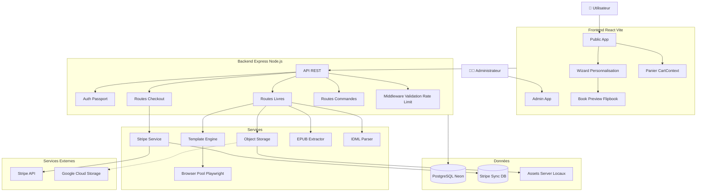
```mermaid
flowchart TB
    User[👤 Utilisateur]
    Admin[👨‍💼 Administrateur]
    
    subgraph Frontend[Frontend React Vite]
        PublicApp[Public App]
        AdminApp[Admin App]
        Wizard[Wizard Personnalisation]
        Preview[Book Preview Flipbook]
        Cart[Panier CartContext]
    end
    
    subgraph Backend[Backend Express Node.js]
        API[API REST]
        Auth[Auth Passport]
        BooksRoutes[Routes Livres]
        CheckoutRoutes[Routes Checkout]
        OrdersRoutes[Routes Commandes]
        Middleware[Middleware Validation Rate Limit]
    end
    
    subgraph Services[Services]
        TemplateEngine[Template Engine]
        BrowserPool[Browser Pool Playwright]
        StripeService[Stripe Service]
        ObjectStorage[Object Storage]
        EPUBExtractor[EPUB Extractor]
        IDMLParser[IDML Parser]
    end
    
    subgraph Data[Données]
        PostgreSQL[(PostgreSQL Neon)]
        StripeDB[(Stripe Sync DB)]
        Assets[Assets Server Locaux]
    end
    
    subgraph External[Services Externes]
        StripeAPI[Stripe API]
        GCS[Google Cloud Storage]
    end
    
    User --> PublicApp
    Admin --> AdminApp
    PublicApp --> Wizard
    Wizard --> Preview
    PublicApp --> Cart
    
    Frontend --> API
    API --> Auth
    API --> Middleware
    API --> BooksRoutes
    API --> CheckoutRoutes
    API --> OrdersRoutes
    
    BooksRoutes --> TemplateEngine
    BooksRoutes --> ObjectStorage
    BooksRoutes --> EPUBExtractor
    BooksRoutes --> IDMLParser
    TemplateEngine --> BrowserPool
    CheckoutRoutes --> StripeService
    
    Backend --> PostgreSQL
    StripeService --> StripeDB
    ObjectStorage --> Assets
    ObjectStorage -.-> GCS
    StripeService --> StripeAPI
```

### Flux de données principal

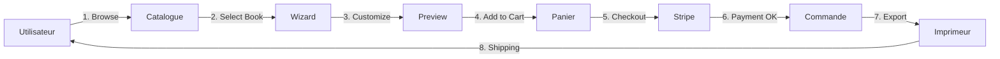
```mermaid
flowchart LR
    A[Utilisateur] -->|1. Browse| B[Catalogue]
    B -->|2. Select Book| C[Wizard]
    C -->|3. Customize| D[Preview]
    D -->|4. Add to Cart| E[Panier]
    E -->|5. Checkout| F[Stripe]
    F -->|6. Payment OK| G[Commande]
    G -->|7. Export| H[Imprimeur]
    H -->|8. Shipping| A
```

---

## 2. Flux Import EPUB/IDML

### Processus complet d'import

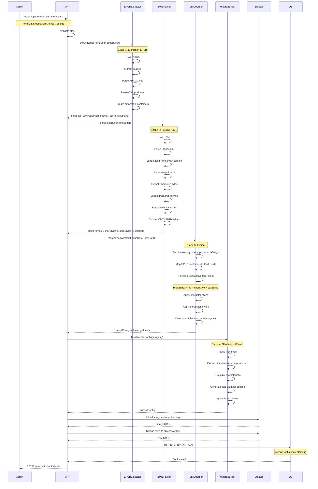
```mermaid
sequenceDiagram
    participant Admin
    participant API
    participant EPUBExtractor
    participant IDMLParser
    participant IDMLMerger
    participant WizardBuilder
    participant Storage
    participant DB
    
    Admin->>API: POST /api/books/import-storyboard
    Note over Admin,API: FormData: epub, idml, fonts[], bookId
    
    API->>API: Validate files
    API->>EPUBExtractor: extractEpubFromBuffer(epubBuffer)
    
    Note over EPUBExtractor: Étape 1: Extraction EPUB
    EPUBExtractor->>EPUBExtractor: Unzip EPUB
    EPUBExtractor->>EPUBExtractor: Extract images
    EPUBExtractor->>EPUBExtractor: Parse XHTML files
    EPUBExtractor->>EPUBExtractor: Parse CSS positions
    EPUBExtractor->>EPUBExtractor: Create empty text containers
    EPUBExtractor-->>API: {images[], textPositions[], pages[], cssFontMapping}
    
    API->>IDMLParser: parseIdmlBuffer(idmlBuffer)
    
    Note over IDMLParser: Étape 2: Parsing IDML
    IDMLParser->>IDMLParser: Unzip IDML
    IDMLParser->>IDMLParser: Parse Stories.xml
    IDMLParser->>IDMLParser: Extract textFrames with content
    IDMLParser->>IDMLParser: Parse Graphic.xml
    IDMLParser->>IDMLParser: Extract CharacterStyles
    IDMLParser->>IDMLParser: Extract ParagraphStyles
    IDMLParser->>IDMLParser: Extract color swatches
    IDMLParser->>IDMLParser: Convert CMYK/RGB to Hex
    IDMLParser-->>API: {textFrames[], charStyles{}, paraStyles{}, colors{}}
    
    API->>IDMLMerger: mergeEpubWithIdml(epubData, idmlData)
    
    Note over IDMLMerger: Étape 3: Fusion
    IDMLMerger->>IDMLMerger: Sort by reading order top-bottom left-right
    IDMLMerger->>IDMLMerger: Map EPUB containers to IDML texts
    IDMLMerger->>IDMLMerger: For each text resolve fontFamily
    Note over IDMLMerger: Hierarchy: inline > charStyle > paraStyle
    IDMLMerger->>IDMLMerger: Apply character styles
    IDMLMerger->>IDMLMerger: Apply paragraph styles
    IDMLMerger->>IDMLMerger: Detect variables nom_enfant age etc
    IDMLMerger-->>API: contentConfig with merged texts
    
    API->>WizardBuilder: buildWizardConfig(images[])
    
    Note over WizardBuilder: Étape 4: Génération Wizard
    WizardBuilder->>WizardBuilder: Parse filenames
    WizardBuilder->>WizardBuilder: Extract characteristics hero skin hair
    WizardBuilder->>WizardBuilder: Group by characteristic
    WizardBuilder->>WizardBuilder: Generate tabs variants options
    WizardBuilder->>WizardBuilder: Apply French labels
    WizardBuilder-->>API: wizardConfig
    
    API->>Storage: Upload images to object storage
    Storage-->>API: Image URLs
    
    API->>Storage: Upload fonts to object storage
    Storage-->>API: Font URLs
    
    API->>DB: INSERT or UPDATE book
    Note over DB: wizardConfig contentConfig
    DB-->>API: Book saved
    
    API-->>Admin: 201 Created with book details
```

### Détail Fusion EPUB + IDML

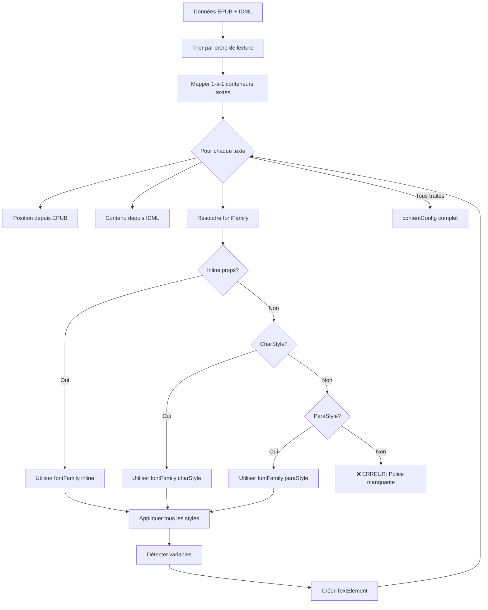
```mermaid
flowchart TD
    Start[Données EPUB + IDML] --> Sort[Trier par ordre de lecture]
    Sort --> Map[Mapper 1-à-1 conteneurs textes]
    
    Map --> Loop{Pour chaque texte}
    Loop --> GetPos[Position depuis EPUB]
    Loop --> GetContent[Contenu depuis IDML]
    Loop --> ResolveFont[Résoudre fontFamily]
    
    ResolveFont --> CheckInline{Inline props?}
    CheckInline -->|Oui| UseInline[Utiliser fontFamily inline]
    CheckInline -->|Non| CheckChar{CharStyle?}
    
    CheckChar -->|Oui| UseChar[Utiliser fontFamily charStyle]
    CheckChar -->|Non| CheckPara{ParaStyle?}
    
    CheckPara -->|Oui| UsePara[Utiliser fontFamily paraStyle]
    CheckPara -->|Non| Error[❌ ERREUR: Police manquante]
    
    UseInline --> ApplyStyles[Appliquer tous les styles]
    UseChar --> ApplyStyles
    UsePara --> ApplyStyles
    
    ApplyStyles --> DetectVars[Détecter variables]
    DetectVars --> CreateElement[Créer TextElement]
    CreateElement --> Loop
    
    Loop -->|Tous traités| Result[contentConfig complet]
```

---

## 3. Flux Personnalisation Utilisateur

### Workflow complet

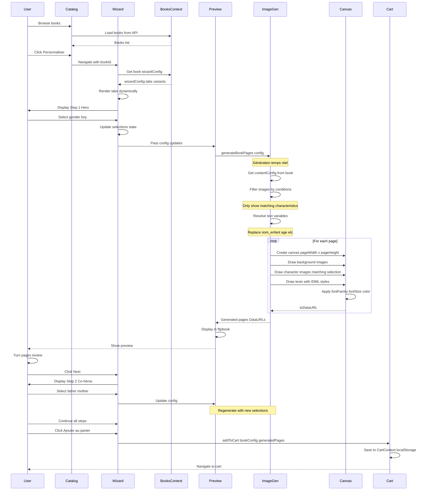
```mermaid
sequenceDiagram
    participant User
    participant Catalog
    participant Wizard
    participant BooksContext
    participant Preview
    participant ImageGen
    participant Canvas
    participant Cart
    
    User->>Catalog: Browse books
    Catalog->>BooksContext: Load books from API
    BooksContext-->>Catalog: Books list
    
    User->>Catalog: Click Personnaliser
    Catalog->>Wizard: Navigate with bookId
    
    Wizard->>BooksContext: Get book wizardConfig
    BooksContext-->>Wizard: wizardConfig tabs variants
    Wizard->>Wizard: Render tabs dynamically
    Wizard->>User: Display Step 1 Hero
    
    User->>Wizard: Select gender boy
    Wizard->>Wizard: Update selections state
    Wizard->>Preview: Pass config updates
    
    Preview->>ImageGen: generateBookPages config
    
    Note over ImageGen: Génération temps réel
    ImageGen->>ImageGen: Get contentConfig from book
    ImageGen->>ImageGen: Filter images by conditions
    Note over ImageGen: Only show matching characteristics
    ImageGen->>ImageGen: Resolve text variables
    Note over ImageGen: Replace nom_enfant age etc
    
    loop For each page
        ImageGen->>Canvas: Create canvas pageWidth x pageHeight
        ImageGen->>Canvas: Draw background images
        ImageGen->>Canvas: Draw character images matching selection
        ImageGen->>Canvas: Draw texts with IDML styles
        Canvas->>Canvas: Apply fontFamily fontSize color
        Canvas-->>ImageGen: toDataURL
    end
    
    ImageGen-->>Preview: Generated pages DataURLs
    Preview->>Preview: Display in flipbook
    Preview-->>User: Show preview
    
    User->>User: Turn pages review
    User->>Wizard: Click Next
    
    Wizard->>User: Display Step 2 Co-héros
    User->>Wizard: Select father mother
    Wizard->>Preview: Update config
    Note over Preview,ImageGen: Regenerate with new selections
    
    User->>Wizard: Continue all steps
    User->>Wizard: Click Ajouter au panier
    
    Wizard->>Cart: addToCart bookConfig generatedPages
    Cart->>Cart: Save to CartContext localStorage
    Cart-->>User: Navigate to cart
```

### Génération d'images dynamique

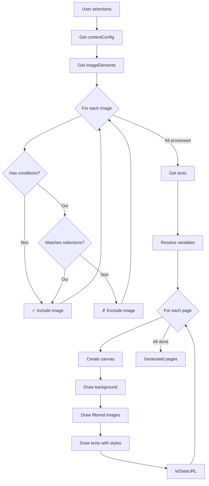
```mermaid
flowchart TD
    Start[User selections] --> GetConfig[Get contentConfig]
    GetConfig --> GetImages[Get imageElements]
    
    GetImages --> FilterLoop{For each image}
    
    FilterLoop --> CheckConditions{Has conditions?}
    CheckConditions -->|Non| Include[✓ Include image]
    CheckConditions -->|Oui| CheckMatch{Matches selections?}
    
    CheckMatch -->|Oui| Include
    CheckMatch -->|Non| Exclude[✗ Exclude image]
    
    Include --> FilterLoop
    Exclude --> FilterLoop
    
    FilterLoop -->|All processed| GetTexts[Get texts]
    GetTexts --> ResolveVars[Resolve variables]
    
    ResolveVars --> RenderLoop{For each page}
    
    RenderLoop --> CreateCanvas[Create canvas]
    CreateCanvas --> DrawBG[Draw background]
    DrawBG --> DrawImages[Draw filtered images]
    DrawImages --> DrawTexts[Draw texts with styles]
    DrawTexts --> Export[toDataURL]
    
    Export --> RenderLoop
    RenderLoop -->|All done| Result[Generated pages]
```

---

## 4. Flux Checkout et Paiement

### Processus complet

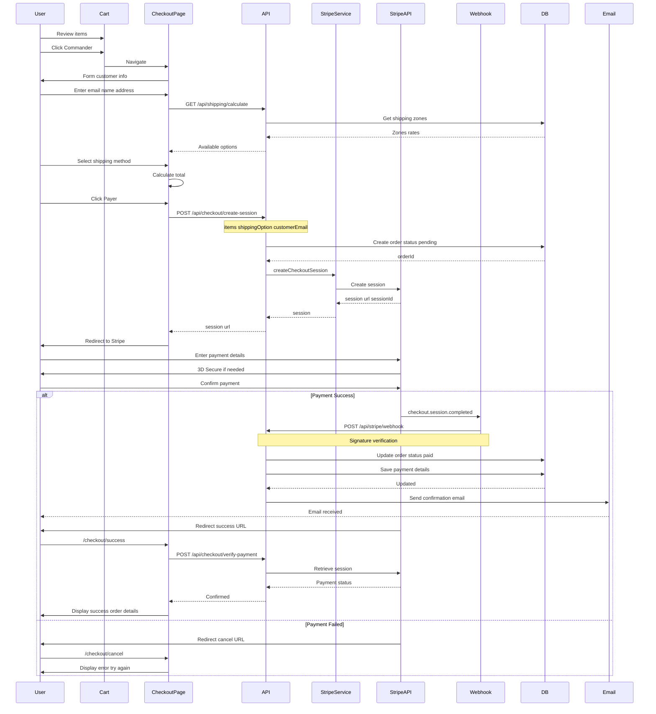
```mermaid
sequenceDiagram
    participant User
    participant Cart
    participant CheckoutPage
    participant API
    participant StripeService
    participant StripeAPI
    participant Webhook
    participant DB
    participant Email
    
    User->>Cart: Review items
    User->>Cart: Click Commander
    Cart->>CheckoutPage: Navigate
    
    CheckoutPage->>User: Form customer info
    User->>CheckoutPage: Enter email name address
    
    CheckoutPage->>API: GET /api/shipping/calculate
    API->>DB: Get shipping zones
    DB-->>API: Zones rates
    API-->>CheckoutPage: Available options
    
    User->>CheckoutPage: Select shipping method
    CheckoutPage->>CheckoutPage: Calculate total
    
    User->>CheckoutPage: Click Payer
    
    CheckoutPage->>API: POST /api/checkout/create-session
    Note over API: items shippingOption customerEmail
    
    API->>DB: Create order status pending
    DB-->>API: orderId
    
    API->>StripeService: createCheckoutSession
    StripeService->>StripeAPI: Create session
    StripeAPI-->>StripeService: session url sessionId
    StripeService-->>API: session
    
    API-->>CheckoutPage: session url
    CheckoutPage->>User: Redirect to Stripe
    
    User->>StripeAPI: Enter payment details
    StripeAPI->>User: 3D Secure if needed
    User->>StripeAPI: Confirm payment
    
    alt Payment Success
        StripeAPI->>Webhook: checkout.session.completed
        Webhook->>API: POST /api/stripe/webhook
        Note over Webhook,API: Signature verification
        
        API->>DB: Update order status paid
        API->>DB: Save payment details
        DB-->>API: Updated
        
        API->>Email: Send confirmation email
        Email-->>User: Email received
        
        StripeAPI->>User: Redirect success URL
        User->>CheckoutPage: /checkout/success
        
        CheckoutPage->>API: POST /api/checkout/verify-payment
        API->>StripeAPI: Retrieve session
        StripeAPI-->>API: Payment status
        API-->>CheckoutPage: Confirmed
        
        CheckoutPage->>User: Display success order details
        
    else Payment Failed
        StripeAPI->>User: Redirect cancel URL
        User->>CheckoutPage: /checkout/cancel
        CheckoutPage->>User: Display error try again
    end
```

### Webhooks Stripe

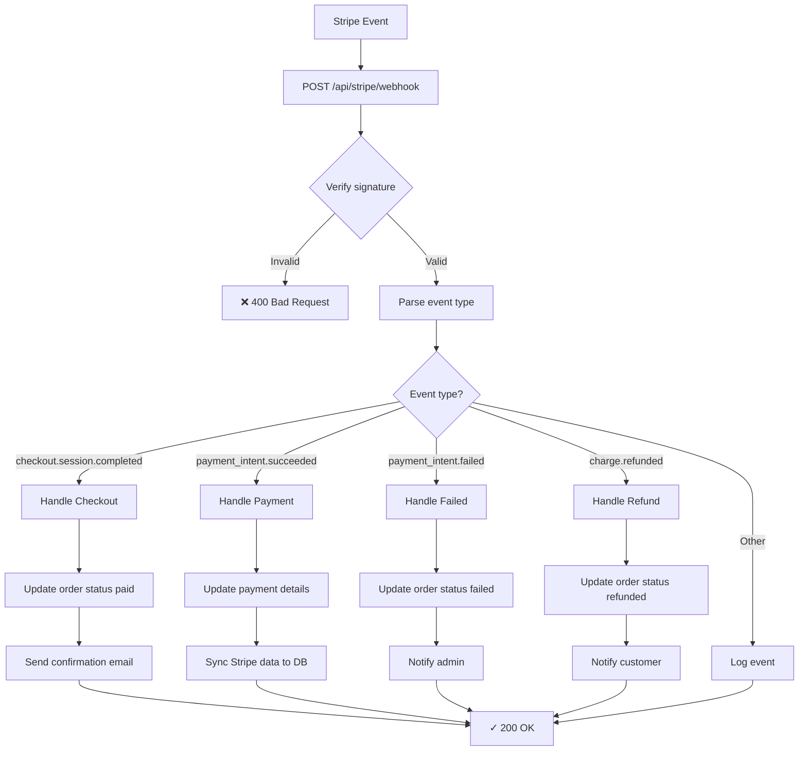
```mermaid
flowchart TD
    Start[Stripe Event] --> Webhook[POST /api/stripe/webhook]
    Webhook --> VerifySig{Verify signature}
    
    VerifySig -->|Invalid| Reject[❌ 400 Bad Request]
    VerifySig -->|Valid| ParseEvent[Parse event type]
    
    ParseEvent --> CheckType{Event type?}
    
    CheckType -->|checkout.session.completed| HandleCheckout[Handle Checkout]
    CheckType -->|payment_intent.succeeded| HandlePayment[Handle Payment]
    CheckType -->|payment_intent.failed| HandleFailed[Handle Failed]
    CheckType -->|charge.refunded| HandleRefund[Handle Refund]
    CheckType -->|Other| Log[Log event]
    
    HandleCheckout --> UpdateOrder[Update order status paid]
    HandlePayment --> UpdatePayment[Update payment details]
    HandleFailed --> UpdateFailed[Update order status failed]
    HandleRefund --> UpdateRefund[Update order status refunded]
    
    UpdateOrder --> SendEmail[Send confirmation email]
    UpdatePayment --> SyncDB[Sync Stripe data to DB]
    UpdateFailed --> NotifyAdmin[Notify admin]
    UpdateRefund --> NotifyCustomer[Notify customer]
    
    SendEmail --> Success[✓ 200 OK]
    SyncDB --> Success
    NotifyAdmin --> Success
    NotifyCustomer --> Success
    Log --> Success
```

---

## 5. Architecture Frontend

### Structure des composants React

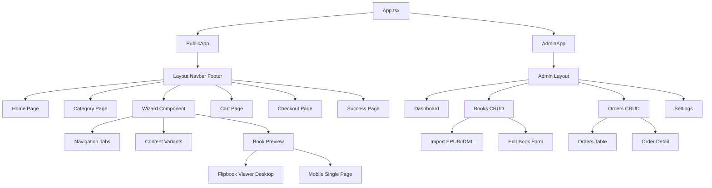
```mermaid
graph TD
    App[App.tsx] --> PublicApp[PublicApp]
    App --> AdminApp[AdminApp]
    
    PublicApp --> Layout[Layout Navbar Footer]
    Layout --> Home[Home Page]
    Layout --> Category[Category Page]
    Layout --> Wizard[Wizard Component]
    Layout --> CartPage[Cart Page]
    Layout --> CheckoutPage[Checkout Page]
    Layout --> Success[Success Page]
    
    Wizard --> WizardNav[Navigation Tabs]
    Wizard --> WizardContent[Content Variants]
    Wizard --> BookPreview[Book Preview]
    
    BookPreview --> FlipbookViewer[Flipbook Viewer Desktop]
    BookPreview --> MobileViewer[Mobile Single Page]
    
    AdminApp --> AdminLayout[Admin Layout]
    AdminLayout --> Dashboard[Dashboard]
    AdminLayout --> BooksCRUD[Books CRUD]
    AdminLayout --> OrdersCRUD[Orders CRUD]
    AdminLayout --> Settings[Settings]
    
    BooksCRUD --> ImportStoryboard[Import EPUB/IDML]
    BooksCRUD --> EditBook[Edit Book Form]
    
    OrdersCRUD --> OrdersList[Orders Table]
    OrdersCRUD --> OrderDetail[Order Detail]
```

### Routing Structure

```mermaid
flowchart LR
    Root[/] --> HomeRoute[Home]
    Root --> CategoryRoute[/category/:name]
    Root --> WizardRoute[/wizard/:bookId]
    Root --> CartRoute[/cart]
    Root --> CheckoutRoute[/checkout]
    Root --> SuccessRoute[/checkout/success]
    Root --> CancelRoute[/checkout/cancel]
    
    Root --> AdminRoot[/admin]
    AdminRoot --> AdminDash[/admin/dashboard]
    AdminRoot --> AdminBooks[/admin/books]
    AdminRoot --> AdminOrders[/admin/orders]
    AdminRoot --> AdminCustomers[/admin/customers]
    AdminRoot --> AdminShipping[/admin/shipping]
    AdminRoot --> AdminSettings[/admin/settings]
```

---

## 6. Architecture Backend

### Structure des routes

```mermaid
flowchart TD
    Express[Express App] --> Middleware[Global Middleware]
    
    Middleware --> Compression[compression]
    Middleware --> BodyParser[body-parser JSON]
    Middleware --> ErrorHandler[Error Handler]
    
    Express --> HealthRoutes[/health]
    Express --> BooksRoutes[/api/books]
    Express --> CheckoutRoutes[/api/checkout]
    Express --> OrdersRoutes[/api/orders]
    Express --> CustomersRoutes[/api/customers]
    Express --> ShippingRoutes[/api/shipping]
    Express --> MenusRoutes[/api/menus]
    Express --> SettingsRoutes[/api/settings]
    Express --> StripeWebhook[/api/stripe/webhook]
    
    BooksRoutes --> GetBooks[GET /]
    BooksRoutes --> GetBook[GET /:id]
    BooksRoutes --> CreateBook[POST /]
    BooksRoutes --> UpdateBook[PATCH /:id]
    BooksRoutes --> ImportStoryboard[POST /import-storyboard]
    BooksRoutes --> RenderPages[POST /:id/render-pages]
    
    CheckoutRoutes --> CreateSession[POST /create-session]
    CheckoutRoutes --> VerifyPayment[POST /verify-payment]
    CheckoutRoutes --> GetConfig[GET /stripe/config]
    
    OrdersRoutes --> GetOrders[GET /]
    OrdersRoutes --> GetOrder[GET /:id]
    OrdersRoutes --> UpdateOrder[PATCH /:id]
```

### Middleware Stack

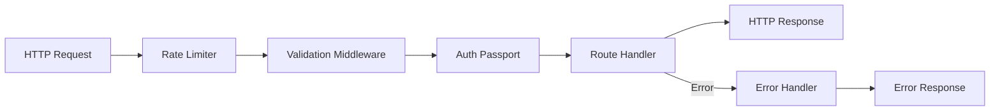
```mermaid
flowchart LR
    Request[HTTP Request] --> RateLimit[Rate Limiter]
    RateLimit --> Validation[Validation Middleware]
    Validation --> Auth[Auth Passport]
    Auth --> RouteHandler[Route Handler]
    RouteHandler --> Response[HTTP Response]
    
    RouteHandler -->|Error| ErrorHandler[Error Handler]
    ErrorHandler --> ErrorResponse[Error Response]
```

---

## 7. Modèle de Données (ERD)

### Schéma Base de Données

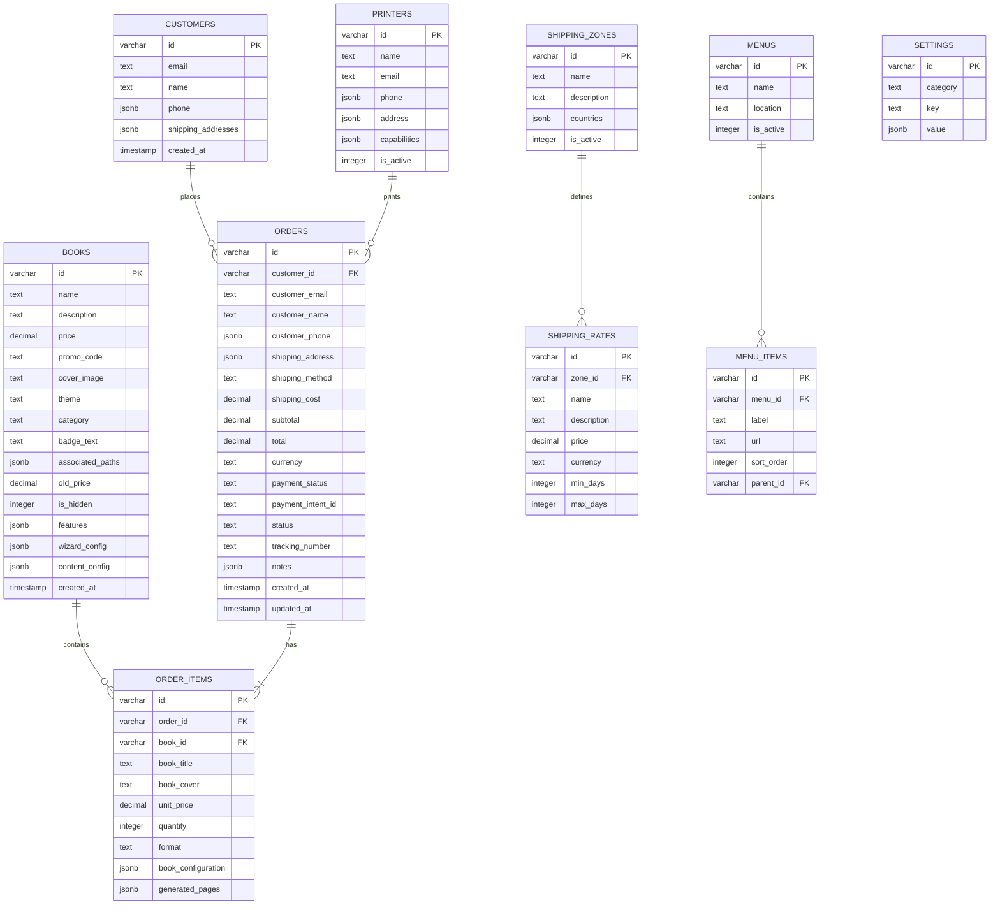
```mermaid
erDiagram
    BOOKS ||--o{ ORDER_ITEMS : contains
    ORDERS ||--|{ ORDER_ITEMS : has
    CUSTOMERS ||--o{ ORDERS : places
    SHIPPING_ZONES ||--o{ SHIPPING_RATES : defines
    PRINTERS ||--o{ ORDERS : prints
    MENUS ||--o{ MENU_ITEMS : contains
    
    BOOKS {
        varchar id PK
        text name
        text description
        decimal price
        text promo_code
        text cover_image
        text theme
        text category
        text badge_text
        jsonb associated_paths
        decimal old_price
        integer is_hidden
        jsonb features
        jsonb wizard_config
        jsonb content_config
        timestamp created_at
    }
    
    ORDERS {
        varchar id PK
        varchar customer_id FK
        text customer_email
        text customer_name
        jsonb customer_phone
        jsonb shipping_address
        text shipping_method
        decimal shipping_cost
        decimal subtotal
        decimal total
        text currency
        text payment_status
        text payment_intent_id
        text status
        text tracking_number
        jsonb notes
        timestamp created_at
        timestamp updated_at
    }
    
    ORDER_ITEMS {
        varchar id PK
        varchar order_id FK
        varchar book_id FK
        text book_title
        text book_cover
        decimal unit_price
        integer quantity
        text format
        jsonb book_configuration
        jsonb generated_pages
    }
    
    CUSTOMERS {
        varchar id PK
        text email
        text name
        jsonb phone
        jsonb shipping_addresses
        timestamp created_at
    }
    
    SHIPPING_ZONES {
        varchar id PK
        text name
        text description
        jsonb countries
        integer is_active
    }
    
    SHIPPING_RATES {
        varchar id PK
        varchar zone_id FK
        text name
        text description
        decimal price
        text currency
        integer min_days
        integer max_days
    }
    
    PRINTERS {
        varchar id PK
        text name
        text email
        jsonb phone
        jsonb address
        jsonb capabilities
        integer is_active
    }
    
    MENUS {
        varchar id PK
        text name
        text location
        integer is_active
    }
    
    MENU_ITEMS {
        varchar id PK
        varchar menu_id FK
        text label
        text url
        integer sort_order
        varchar parent_id FK
    }
    
    SETTINGS {
        varchar id PK
        text category
        text key
        jsonb value
    }
```

### Relations principales

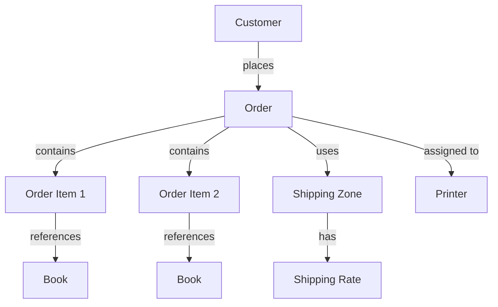
```mermaid
flowchart TD
    Customer[Customer] -->|places| Order[Order]
    Order -->|contains| OrderItem1[Order Item 1]
    Order -->|contains| OrderItem2[Order Item 2]
    
    OrderItem1 -->|references| Book1[Book]
    OrderItem2 -->|references| Book2[Book]
    
    Order -->|uses| ShippingZone[Shipping Zone]
    ShippingZone -->|has| ShippingRate[Shipping Rate]
    
    Order -->|assigned to| Printer[Printer]
```

---

## 8. State Management

### Architecture State Frontend

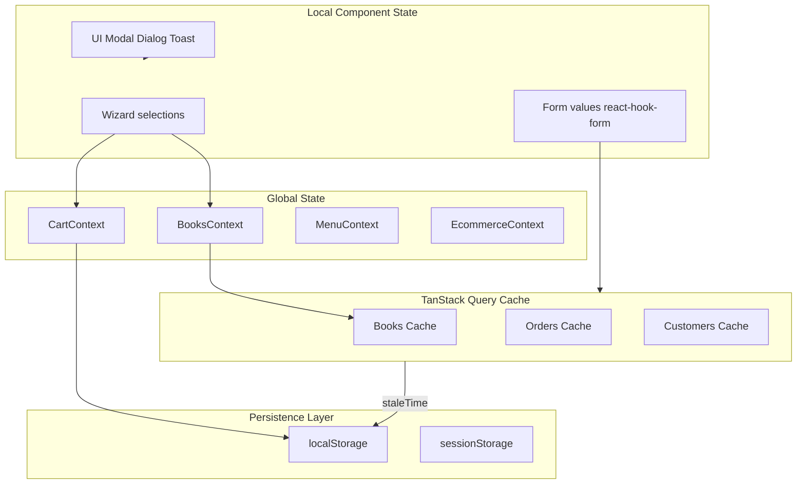
```mermaid
flowchart TD
    subgraph Global[Global State]
        BooksContext[BooksContext]
        CartContext[CartContext]
        MenuContext[MenuContext]
        EcommerceContext[EcommerceContext]
    end
    
    subgraph ReactQuery[TanStack Query Cache]
        BooksCache[Books Cache]
        OrdersCache[Orders Cache]
        CustomersCache[Customers Cache]
    end
    
    subgraph Local[Local Component State]
        WizardState[Wizard selections]
        FormState[Form values react-hook-form]
        UIState[UI Modal Dialog Toast]
    end
    
    subgraph Persistence[Persistence Layer]
        LocalStorage[localStorage]
        SessionStorage[sessionStorage]
    end
    
    BooksContext --> BooksCache
    CartContext --> LocalStorage
    
    WizardState --> BooksContext
    WizardState --> CartContext
    
    FormState --> ReactQuery
    
    UIState --> Local
    
    ReactQuery -->|staleTime| LocalStorage
```

### Flux de données Context

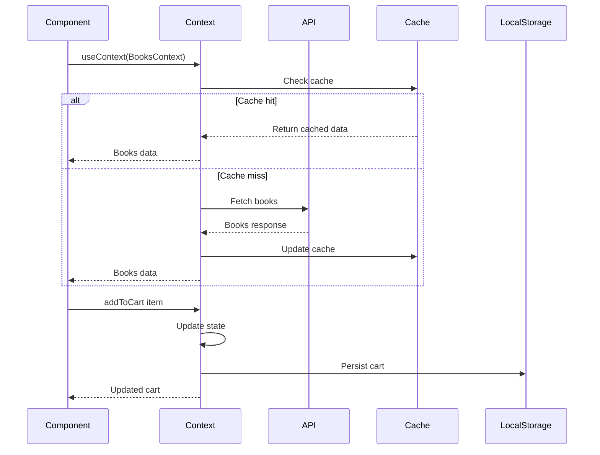
```mermaid
sequenceDiagram
    participant Component
    participant Context
    participant API
    participant Cache
    participant LocalStorage
    
    Component->>Context: useContext(BooksContext)
    Context->>Cache: Check cache
    
    alt Cache hit
        Cache-->>Context: Return cached data
        Context-->>Component: Books data
    else Cache miss
        Context->>API: Fetch books
        API-->>Context: Books response
        Context->>Cache: Update cache
        Context-->>Component: Books data
    end
    
    Component->>Context: addToCart item
    Context->>Context: Update state
    Context->>LocalStorage: Persist cart
    Context-->>Component: Updated cart
```

---

## 9. Flux Rendu Pages

### Comparaison Client vs Server

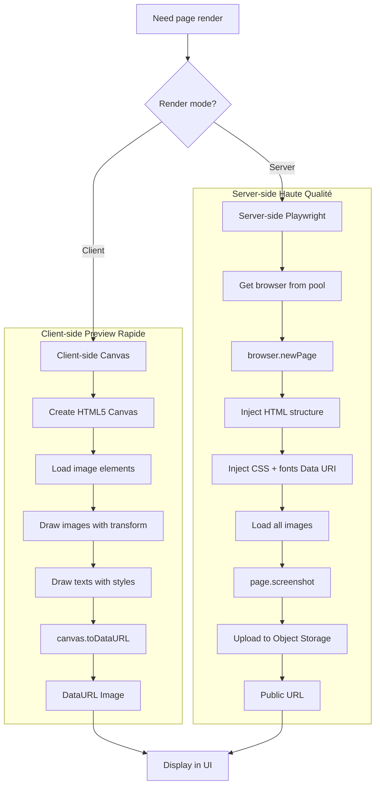
```mermaid
flowchart TD
    Start[Need page render] --> Decision{Render mode?}
    
    Decision -->|Client| ClientMode[Client-side Canvas]
    Decision -->|Server| ServerMode[Server-side Playwright]
    
    subgraph ClientSide[Client-side Preview Rapide]
        ClientMode --> CreateCanvas[Create HTML5 Canvas]
        CreateCanvas --> LoadImages[Load image elements]
        LoadImages --> DrawImages[Draw images with transform]
        DrawImages --> DrawTexts[Draw texts with styles]
        DrawTexts --> ExportDataURL[canvas.toDataURL]
        ExportDataURL --> ClientResult[DataURL Image]
    end
    
    subgraph ServerSide[Server-side Haute Qualité]
        ServerMode --> GetBrowser[Get browser from pool]
        GetBrowser --> CreatePage[browser.newPage]
        CreatePage --> InjectHTML[Inject HTML structure]
        InjectHTML --> InjectCSS[Inject CSS + fonts Data URI]
        InjectCSS --> LoadServerImages[Load all images]
        LoadServerImages --> Screenshot[page.screenshot]
        Screenshot --> UploadStorage[Upload to Object Storage]
        UploadStorage --> ServerResult[Public URL]
    end
    
    ClientResult --> Display[Display in UI]
    ServerResult --> Display
```

### Browser Pool Architecture

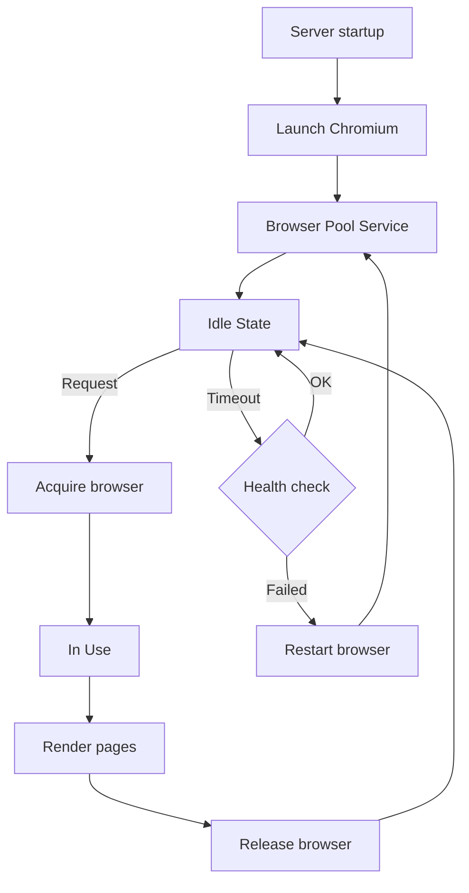
```mermaid
flowchart TD
    Start[Server startup] --> LaunchBrowser[Launch Chromium]
    LaunchBrowser --> BrowserPool[Browser Pool Service]
    
    BrowserPool --> Idle[Idle State]
    
    Idle -->|Request| Acquire[Acquire browser]
    Acquire --> InUse[In Use]
    InUse --> Process[Render pages]
    Process --> Release[Release browser]
    Release --> Idle
    
    Idle -->|Timeout| HealthCheck{Health check}
    HealthCheck -->|OK| Idle
    HealthCheck -->|Failed| Restart[Restart browser]
    Restart --> BrowserPool
```

---

## 10. Sécurité et Rate Limiting

### Stratégie Rate Limiting

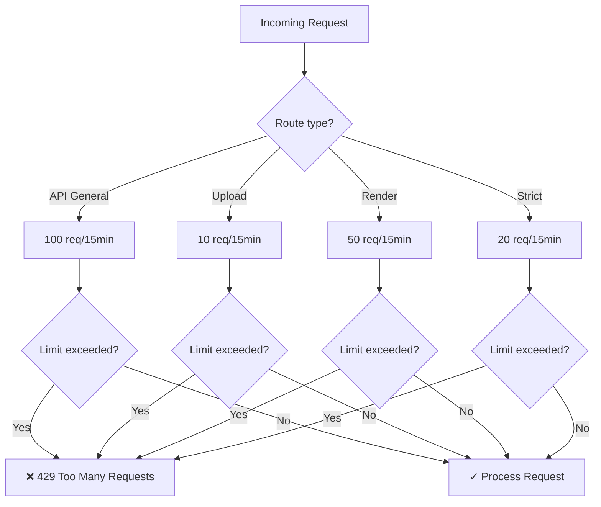
```mermaid
flowchart TD
    Request[Incoming Request] --> IdentifyRoute{Route type?}
    
    IdentifyRoute -->|API General| APILimiter[100 req/15min]
    IdentifyRoute -->|Upload| UploadLimiter[10 req/15min]
    IdentifyRoute -->|Render| RenderLimiter[50 req/15min]
    IdentifyRoute -->|Strict| StrictLimiter[20 req/15min]
    
    APILimiter --> CheckLimit1{Limit exceeded?}
    UploadLimiter --> CheckLimit2{Limit exceeded?}
    RenderLimiter --> CheckLimit3{Limit exceeded?}
    StrictLimiter --> CheckLimit4{Limit exceeded?}
    
    CheckLimit1 -->|Yes| Block[❌ 429 Too Many Requests]
    CheckLimit2 -->|Yes| Block
    CheckLimit3 -->|Yes| Block
    CheckLimit4 -->|Yes| Block
    
    CheckLimit1 -->|No| Allow[✓ Process Request]
    CheckLimit2 -->|No| Allow
    CheckLimit3 -->|No| Allow
    CheckLimit4 -->|No| Allow
```

### Pipeline de Validation

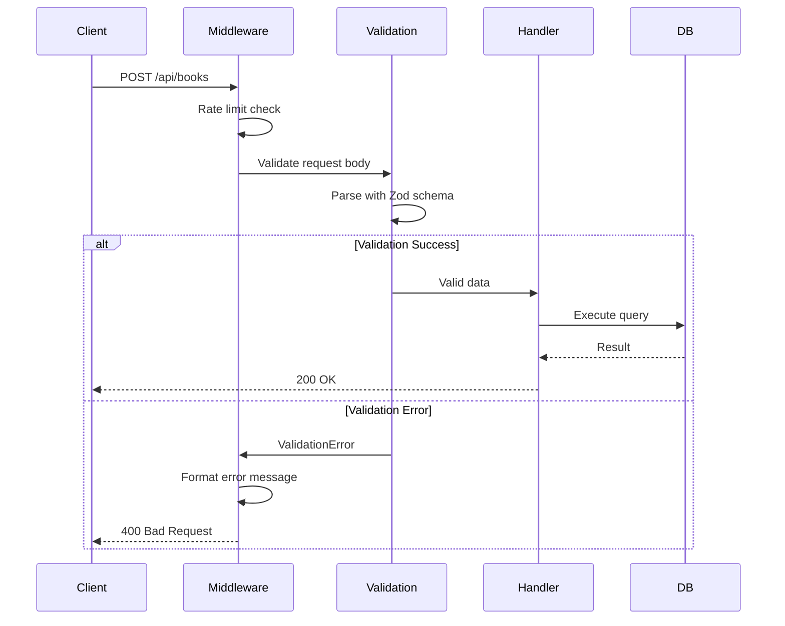
```mermaid
sequenceDiagram
    participant Client
    participant Middleware
    participant Validation
    participant Handler
    participant DB
    
    Client->>Middleware: POST /api/books
    Middleware->>Middleware: Rate limit check
    Middleware->>Validation: Validate request body
    
    Validation->>Validation: Parse with Zod schema
    
    alt Validation Success
        Validation->>Handler: Valid data
        Handler->>DB: Execute query
        DB-->>Handler: Result
        Handler-->>Client: 200 OK
    else Validation Error
        Validation->>Middleware: ValidationError
        Middleware->>Middleware: Format error message
        Middleware-->>Client: 400 Bad Request
    end
```

### Gestion Erreurs

```mermaid
flowchart TD
    Error[Error occurs] --> ErrorType{Error type?}
    
    ErrorType -->|AppError| CustomError[Custom Error]
    ErrorType -->|ZodError| ValidationError[Validation Error]
    ErrorType -->|DatabaseError| DBError[Database Error]
    ErrorType -->|Unknown| UnknownError[Unknown Error]
    
    CustomError --> Log[Log with context]
    ValidationError --> Log
    DBError --> Log
    UnknownError --> Log
    
    Log --> Env{Environment?}
    
    Env -->|Development| DetailedResponse[Detailed error + stack]
    Env -->|Production| GenericResponse[Generic error message]
    
    DetailedResponse --> Client[Send to client]
    GenericResponse --> Client
    
    Log --> Monitoring[Send to monitoring service]
```

---

## 11. Deployment Architecture

### Production Setup

```mermaid
flowchart TD
    subgraph Internet
        Users[Users]
        CDN[CDN CloudFlare]
    end
    
    subgraph Infra[Cloud Infrastructure]
        LoadBalancer[Load Balancer]
        
        subgraph AppServers[Application Servers]
            Server1[Node.js Server 1]
            Server2[Node.js Server 2]
        end
        
        subgraph StaticAssets[Static Assets]
            AssetsFolder[server/assets/]
        end
    end
    
    subgraph External[External Services]
        NeonDB[(Neon PostgreSQL)]
        GCS[Google Cloud Storage]
        StripeService[Stripe API]
    end
    
    Users --> CDN
    CDN --> LoadBalancer
    LoadBalancer --> Server1
    LoadBalancer --> Server2
    
    Server1 --> NeonDB
    Server2 --> NeonDB
    
    Server1 --> AssetsFolder
    Server2 --> AssetsFolder
    
    Server1 -.-> GCS
    Server2 -.-> GCS
    
    Server1 --> StripeService
    Server2 --> StripeService
```

---

## 12. CI/CD Pipeline

### GitHub Actions Workflow

```mermaid
flowchart LR
    Push[git push] --> Trigger[GitHub Actions]
    
    Trigger --> TypeCheck[tsc --noEmit]
    Trigger --> Tests[npm test]
    Trigger --> Build[npm run build]
    
    TypeCheck -->|Pass| Merge[Merge OK]
    Tests -->|Pass| Merge
    Build -->|Pass| Merge
    
    TypeCheck -->|Fail| Block[❌ Block]
    Tests -->|Fail| Block
    Build -->|Fail| Block
    
    Merge --> Deploy{Branch?}
    Deploy -->|main| Production[Deploy Production]
    Deploy -->|dev| Staging[Deploy Staging]
```

---

## Légende

### Icônes utilisées

- 👤 Utilisateur
- 👨‍💼 Administrateur
- [(Database)] Base de données
- [Service] Service/Module
- {Decision} Point de décision
- ✓ Succès
- ❌ Erreur

### Types de flèches

- `-->` Flux principal
- `-.->` Flux optionnel
- `==>` Flux de données important
- `-->>` Retour de résultat

---

**Version :** 1.0  
**Date :** Janvier 2026  
**Mise à jour :** Maintenue en synchronisation avec l'architecture réelle
