# Diagrammes d'Architecture - NuageBook

Ce document contient tous les diagrammes d'architecture du système NuageBook.

---

## Table des Matières

1. [Architecture Globale](#1-architecture-globale)
2. [Flux Import EPUB/IDML](#2-flux-import-epubidml)
3. [Flux Personnalisation Utilisateur](#3-flux-personnalisation-utilisateur)
4. [Flux Checkout et Paiement](#4-flux-checkout-et-paiement)
5. [Architecture Frontend](#5-architecture-frontend)
6. [Architecture Backend](#6-architecture-backend)
7. [Modèle de Données (ERD)](#7-modèle-de-données-erd)
8. [State Management](#8-state-management)
9. [Flux Rendu Pages](#9-flux-rendu-pages)
10. [Sécurité et Rate Limiting](#10-sécurité-et-rate-limiting)

---

## 1. Architecture Globale

### Vue d'ensemble du système

```mermaid
flowchart TB
    User[👤 Utilisateur]
    Admin[👨‍💼 Administrateur]
    
    subgraph Frontend[Frontend React Vite]
        PublicApp[Public App]
        AdminApp[Admin App]
        Wizard[Wizard Personnalisation]
        Preview[Book Preview Flipbook]
        Cart[Panier CartContext]
    end
    
    subgraph Backend[Backend Express Node.js]
        API[API REST]
        Auth[Auth Passport]
        BooksRoutes[Routes Livres]
        CheckoutRoutes[Routes Checkout]
        OrdersRoutes[Routes Commandes]
        Middleware[Middleware Validation Rate Limit]
    end
    
    subgraph Services[Services]
        TemplateEngine[Template Engine]
        BrowserPool[Browser Pool Playwright]
        StripeService[Stripe Service]
        ObjectStorage[Object Storage]
        EPUBExtractor[EPUB Extractor]
        IDMLParser[IDML Parser]
    end
    
    subgraph Data[Données]
        PostgreSQL[(PostgreSQL Neon)]
        StripeDB[(Stripe Sync DB)]
        Assets[Assets Server Locaux]
    end
    
    subgraph External[Services Externes]
        StripeAPI[Stripe API]
        GCS[Google Cloud Storage]
    end
    
    User --> PublicApp
    Admin --> AdminApp
    PublicApp --> Wizard
    Wizard --> Preview
    PublicApp --> Cart
    
    Frontend --> API
    API --> Auth
    API --> Middleware
    API --> BooksRoutes
    API --> CheckoutRoutes
    API --> OrdersRoutes
    
    BooksRoutes --> TemplateEngine
    BooksRoutes --> ObjectStorage
    BooksRoutes --> EPUBExtractor
    BooksRoutes --> IDMLParser
    TemplateEngine --> BrowserPool
    CheckoutRoutes --> StripeService
    
    Backend --> PostgreSQL
    StripeService --> StripeDB
    ObjectStorage --> Assets
    ObjectStorage -.-> GCS
    StripeService --> StripeAPI
```



### Flux de données principal


---

## 2. Flux Import EPUB/IDML

### Processus complet d'import

```mermaid
sequenceDiagram
    participant Admin
    participant API
    participant EPUBExtractor
    participant IDMLParser
    participant IDMLMerger
    participant WizardBuilder
    participant Storage
    participant DB
    
    Admin->>API: POST /api/books/import-storyboard
    Note over Admin,API: FormData: epub, idml, fonts[], bookId
    
    API->>API: Validate files
    API->>EPUBExtractor: extractEpubFromBuffer(epubBuffer)
    
    Note over EPUBExtractor: Étape 1: Extraction EPUB
    EPUBExtractor->>EPUBExtractor: Unzip EPUB
    EPUBExtractor->>EPUBExtractor: Extract images
    EPUBExtractor->>EPUBExtractor: Parse XHTML files
    EPUBExtractor->>EPUBExtractor: Parse CSS positions
    EPUBExtractor->>EPUBExtractor: Create empty text containers
    EPUBExtractor-->>API: {images[], textPositions[], pages[], cssFontMapping}
    
    API->>IDMLParser: parseIdmlBuffer(idmlBuffer)
    
    Note over IDMLParser: Étape 2: Parsing IDML
    IDMLParser->>IDMLParser: Unzip IDML
    IDMLParser->>IDMLParser: Parse Stories.xml
    IDMLParser->>IDMLParser: Extract textFrames with content
    IDMLParser->>IDMLParser: Parse Graphic.xml
    IDMLParser->>IDMLParser: Extract CharacterStyles
    IDMLParser->>IDMLParser: Extract ParagraphStyles
    IDMLParser->>IDMLParser: Extract color swatches
    IDMLParser->>IDMLParser: Convert CMYK/RGB to Hex
    IDMLParser-->>API: {textFrames[], charStyles{}, paraStyles{}, colors{}}
    
    API->>IDMLMerger: mergeEpubWithIdml(epubData, idmlData)
    
    Note over IDMLMerger: Étape 3: Fusion
    IDMLMerger->>IDMLMerger: Sort by reading order top-bottom left-right
    IDMLMerger->>IDMLMerger: Map EPUB containers to IDML texts
    IDMLMerger->>IDMLMerger: For each text resolve fontFamily
    Note over IDMLMerger: Hierarchy: inline > charStyle > paraStyle
    IDMLMerger->>IDMLMerger: Apply character styles
    IDMLMerger->>IDMLMerger: Apply paragraph styles
    IDMLMerger->>IDMLMerger: Detect variables nom_enfant age etc
    IDMLMerger-->>API: contentConfig with merged texts
    
    API->>WizardBuilder: buildWizardConfig(images[])
    
    Note over WizardBuilder: Étape 4: Génération Wizard
    WizardBuilder->>WizardBuilder: Parse filenames
    WizardBuilder->>WizardBuilder: Extract characteristics hero skin hair
    WizardBuilder->>WizardBuilder: Group by characteristic
    WizardBuilder->>WizardBuilder: Generate tabs variants options
    WizardBuilder->>WizardBuilder: Apply French labels
    WizardBuilder-->>API: wizardConfig
    
    API->>Storage: Upload images to object storage
    Storage-->>API: Image URLs
    
    API->>Storage: Upload fonts to object storage
    Storage-->>API: Font URLs
    
    API->>DB: INSERT or UPDATE book
    Note over DB: wizardConfig contentConfig
    DB-->>API: Book saved
    
    API-->>Admin: 201 Created with book details
```



### Détail Fusion EPUB + IDML

```mermaid
flowchart TD
    Start[Données EPUB + IDML] --> Sort[Trier par ordre de lecture]
    Sort --> Map[Mapper 1-à-1 conteneurs textes]
    
    Map --> Loop{Pour chaque texte}
    Loop --> GetPos[Position depuis EPUB]
    Loop --> GetContent[Contenu depuis IDML]
    Loop --> ResolveFont[Résoudre fontFamily]
    
    ResolveFont --> CheckInline{Inline props?}
    CheckInline -->|Oui| UseInline[Utiliser fontFamily inline]
    CheckInline -->|Non| CheckChar{CharStyle?}
    
    CheckChar -->|Oui| UseChar[Utiliser fontFamily charStyle]
    CheckChar -->|Non| CheckPara{ParaStyle?}
    
    CheckPara -->|Oui| UsePara[Utiliser fontFamily paraStyle]
    CheckPara -->|Non| Error[❌ ERREUR: Police manquante]
    
    UseInline --> ApplyStyles[Appliquer tous les styles]
    UseChar --> ApplyStyles
    UsePara --> ApplyStyles
    
    ApplyStyles --> DetectVars[Détecter variables]
    DetectVars --> CreateElement[Créer TextElement]
    CreateElement --> Loop
    
    Loop -->|Tous traités| Result[contentConfig complet]
```



---

## 3. Flux Personnalisation Utilisateur

### Workflow complet

```mermaid
sequenceDiagram
    participant User
    participant Catalog
    participant Wizard
    participant BooksContext
    participant Preview
    participant ImageGen
    participant Canvas
    participant Cart
    
    User->>Catalog: Browse books
    Catalog->>BooksContext: Load books from API
    BooksContext-->>Catalog: Books list
    
    User->>Catalog: Click Personnaliser
    Catalog->>Wizard: Navigate with bookId
    
    Wizard->>BooksContext: Get book wizardConfig
    BooksContext-->>Wizard: wizardConfig tabs variants
    Wizard->>Wizard: Render tabs dynamically
    Wizard->>User: Display Step 1 Hero
    
    User->>Wizard: Select gender boy
    Wizard->>Wizard: Update selections state
    Wizard->>Preview: Pass config updates
    
    Preview->>ImageGen: generateBookPages config
    
    Note over ImageGen: Génération temps réel
    ImageGen->>ImageGen: Get contentConfig from book
    ImageGen->>ImageGen: Filter images by conditions
    Note over ImageGen: Only show matching characteristics
    ImageGen->>ImageGen: Resolve text variables
    Note over ImageGen: Replace nom_enfant age etc
    
    loop For each page
        ImageGen->>Canvas: Create canvas pageWidth x pageHeight
        ImageGen->>Canvas: Draw background images
        ImageGen->>Canvas: Draw character images matching selection
        ImageGen->>Canvas: Draw texts with IDML styles
        Canvas->>Canvas: Apply fontFamily fontSize color
        Canvas-->>ImageGen: toDataURL
    end
    
    ImageGen-->>Preview: Generated pages DataURLs
    Preview->>Preview: Display in flipbook
    Preview-->>User: Show preview
    
    User->>User: Turn pages review
    User->>Wizard: Click Next
    
    Wizard->>User: Display Step 2 Co-héros
    User->>Wizard: Select father mother
    Wizard->>Preview: Update config
    Note over Preview,ImageGen: Regenerate with new selections
    
    User->>Wizard: Continue all steps
    User->>Wizard: Click Ajouter au panier
    
    Wizard->>Cart: addToCart bookConfig generatedPages
    Cart->>Cart: Save to CartContext localStorage
    Cart-->>User: Navigate to cart
```



### Génération d'images dynamique


---

## 4. Flux Checkout et Paiement

### Processus complet


### Webhooks Stripe

```mermaid
flowchart TD
    Start[Stripe Event] --> Webhook[POST /api/stripe/webhook]
    Webhook --> VerifySig{Verify signature}
    
    VerifySig -->|Invalid| Reject[❌ 400 Bad Request]
    VerifySig -->|Valid| ParseEvent[Parse event type]
    
    ParseEvent --> CheckType{Event type?}
    
    CheckType -->|checkout.session.completed| HandleCheckout[Handle Checkout]
    CheckType -->|payment_intent.succeeded| HandlePayment[Handle Payment]
    CheckType -->|payment_intent.failed| HandleFailed[Handle Failed]
    CheckType -->|charge.refunded| HandleRefund[Handle Refund]
    CheckType -->|Other| Log[Log event]
    
    HandleCheckout --> UpdateOrder[Update order status paid]
    HandlePayment --> UpdatePayment[Update payment details]
    HandleFailed --> UpdateFailed[Update order status failed]
    HandleRefund --> UpdateRefund[Update order status refunded]
    
    UpdateOrder --> SendEmail[Send confirmation email]
    UpdatePayment --> SyncDB[Sync Stripe data to DB]
    UpdateFailed --> NotifyAdmin[Notify admin]
    UpdateRefund --> NotifyCustomer[Notify customer]
    
    SendEmail --> Success[✓ 200 OK]
    SyncDB --> Success
    NotifyAdmin --> Success
    NotifyCustomer --> Success
    Log --> Success
```



---

## 5. Architecture Frontend

### Structure des composants React


### Routing Structure

```mermaid
flowchart LR
    Root[/] --> HomeRoute[Home]
    Root --> CategoryRoute[/category/:name]
    Root --> WizardRoute[/wizard/:bookId]
    Root --> CartRoute[/cart]
    Root --> CheckoutRoute[/checkout]
    Root --> SuccessRoute[/checkout/success]
    Root --> CancelRoute[/checkout/cancel]
    
    Root --> AdminRoot[/admin]
    AdminRoot --> AdminDash[/admin/dashboard]
    AdminRoot --> AdminBooks[/admin/books]
    AdminRoot --> AdminOrders[/admin/orders]
    AdminRoot --> AdminCustomers[/admin/customers]
    AdminRoot --> AdminShipping[/admin/shipping]
    AdminRoot --> AdminSettings[/admin/settings]
```

---

## 6. Architecture Backend

### Structure des routes

```mermaid
flowchart TD
    Express[Express App] --> Middleware[Global Middleware]
    
    Middleware --> Compression[compression]
    Middleware --> BodyParser[body-parser JSON]
    Middleware --> ErrorHandler[Error Handler]
    
    Express --> HealthRoutes[/health]
    Express --> BooksRoutes[/api/books]
    Express --> CheckoutRoutes[/api/checkout]
    Express --> OrdersRoutes[/api/orders]
    Express --> CustomersRoutes[/api/customers]
    Express --> ShippingRoutes[/api/shipping]
    Express --> MenusRoutes[/api/menus]
    Express --> SettingsRoutes[/api/settings]
    Express --> StripeWebhook[/api/stripe/webhook]
    
    BooksRoutes --> GetBooks[GET /]
    BooksRoutes --> GetBook[GET /:id]
    BooksRoutes --> CreateBook[POST /]
    BooksRoutes --> UpdateBook[PATCH /:id]
    BooksRoutes --> ImportStoryboard[POST /import-storyboard]
    BooksRoutes --> RenderPages[POST /:id/render-pages]
    
    CheckoutRoutes --> CreateSession[POST /create-session]
    CheckoutRoutes --> VerifyPayment[POST /verify-payment]
    CheckoutRoutes --> GetConfig[GET /stripe/config]
    
    OrdersRoutes --> GetOrders[GET /]
    OrdersRoutes --> GetOrder[GET /:id]
    OrdersRoutes --> UpdateOrder[PATCH /:id]
```

### Middleware Stack


---

## 7. Modèle de Données (ERD)

### Schéma Base de Données


### Relations principales


---

## 8. State Management

### Architecture State Frontend


### Flux de données Context


---

## 9. Flux Rendu Pages

### Comparaison Client vs Server

```mermaid
flowchart TD
    Start[Need page render] --> Decision{Render mode?}
    
    Decision -->|Client| ClientMode[Client-side Canvas]
    Decision -->|Server| ServerMode[Server-side Playwright]
    
    subgraph ClientSide[Client-side Preview Rapide]
        ClientMode --> CreateCanvas[Create HTML5 Canvas]
        CreateCanvas --> LoadImages[Load image elements]
        LoadImages --> DrawImages[Draw images with transform]
        DrawImages --> DrawTexts[Draw texts with styles]
        DrawTexts --> ExportDataURL[canvas.toDataURL]
        ExportDataURL --> ClientResult[DataURL Image]
    end
    
    subgraph ServerSide[Server-side Haute Qualité]
        ServerMode --> GetBrowser[Get browser from pool]
        GetBrowser --> CreatePage[browser.newPage]
        CreatePage --> InjectHTML[Inject HTML structure]
        InjectHTML --> InjectCSS[Inject CSS + fonts Data URI]
        InjectCSS --> LoadServerImages[Load all images]
        LoadServerImages --> Screenshot[page.screenshot]
        Screenshot --> UploadStorage[Upload to Object Storage]
        UploadStorage --> ServerResult[Public URL]
    end
    
    ClientResult --> Display[Display in UI]
    ServerResult --> Display
```



### Browser Pool Architecture


---

## 10. Sécurité et Rate Limiting

### Stratégie Rate Limiting

```mermaid
flowchart TD
    Request[Incoming Request] --> IdentifyRoute{Route type?}
    
    IdentifyRoute -->|API General| APILimiter[100 req/15min]
    IdentifyRoute -->|Upload| UploadLimiter[10 req/15min]
    IdentifyRoute -->|Render| RenderLimiter[50 req/15min]
    IdentifyRoute -->|Strict| StrictLimiter[20 req/15min]
    
    APILimiter --> CheckLimit1{Limit exceeded?}
    UploadLimiter --> CheckLimit2{Limit exceeded?}
    RenderLimiter --> CheckLimit3{Limit exceeded?}
    StrictLimiter --> CheckLimit4{Limit exceeded?}
    
    CheckLimit1 -->|Yes| Block[❌ 429 Too Many Requests]
    CheckLimit2 -->|Yes| Block
    CheckLimit3 -->|Yes| Block
    CheckLimit4 -->|Yes| Block
    
    CheckLimit1 -->|No| Allow[✓ Process Request]
    CheckLimit2 -->|No| Allow
    CheckLimit3 -->|No| Allow
    CheckLimit4 -->|No| Allow
```



### Pipeline de Validation


### Gestion Erreurs

```mermaid
flowchart TD
    Error[Error occurs] --> ErrorType{Error type?}
    
    ErrorType -->|AppError| CustomError[Custom Error]
    ErrorType -->|ZodError| ValidationError[Validation Error]
    ErrorType -->|DatabaseError| DBError[Database Error]
    ErrorType -->|Unknown| UnknownError[Unknown Error]
    
    CustomError --> Log[Log with context]
    ValidationError --> Log
    DBError --> Log
    UnknownError --> Log
    
    Log --> Env{Environment?}
    
    Env -->|Development| DetailedResponse[Detailed error + stack]
    Env -->|Production| GenericResponse[Generic error message]
    
    DetailedResponse --> Client[Send to client]
    GenericResponse --> Client
    
    Log --> Monitoring[Send to monitoring service]
```

---

## 11. Deployment Architecture

### Production Setup

```mermaid
flowchart TD
    subgraph Internet
        Users[Users]
        CDN[CDN CloudFlare]
    end
    
    subgraph Infra[Cloud Infrastructure]
        LoadBalancer[Load Balancer]
        
        subgraph AppServers[Application Servers]
            Server1[Node.js Server 1]
            Server2[Node.js Server 2]
        end
        
        subgraph StaticAssets[Static Assets]
            AssetsFolder[server/assets/]
        end
    end
    
    subgraph External[External Services]
        NeonDB[(Neon PostgreSQL)]
        GCS[Google Cloud Storage]
        StripeService[Stripe API]
    end
    
    Users --> CDN
    CDN --> LoadBalancer
    LoadBalancer --> Server1
    LoadBalancer --> Server2
    
    Server1 --> NeonDB
    Server2 --> NeonDB
    
    Server1 --> AssetsFolder
    Server2 --> AssetsFolder
    
    Server1 -.-> GCS
    Server2 -.-> GCS
    
    Server1 --> StripeService
    Server2 --> StripeService
```

---

## 12. CI/CD Pipeline

### GitHub Actions Workflow

```mermaid
flowchart LR
    Push[git push] --> Trigger[GitHub Actions]
    
    Trigger --> TypeCheck[tsc --noEmit]
    Trigger --> Tests[npm test]
    Trigger --> Build[npm run build]
    
    TypeCheck -->|Pass| Merge[Merge OK]
    Tests -->|Pass| Merge
    Build -->|Pass| Merge
    
    TypeCheck -->|Fail| Block[❌ Block]
    Tests -->|Fail| Block
    Build -->|Fail| Block
    
    Merge --> Deploy{Branch?}
    Deploy -->|main| Production[Deploy Production]
    Deploy -->|dev| Staging[Deploy Staging]
```

---

## Légende

### Icônes utilisées

- 👤 Utilisateur
- 👨‍💼 Administrateur
- [(Database)] Base de données
- [Service] Service/Module
- {Decision} Point de décision
- ✓ Succès
- ❌ Erreur

### Types de flèches

- `-->` Flux principal
- `-.->` Flux optionnel
- `==>` Flux de données important
- `-->>` Retour de résultat

---

**Version :** 1.0  
**Date :** Janvier 2026  
**Mise à jour :** Maintenue en synchronisation avec l'architecture réelle
