# Diagrammes Architecture - Système d'Authentification v1.1

**Version:** 1.1.0  
**Date:** 29 Janvier 2026

---

## 1. Vue d'Ensemble Architecture

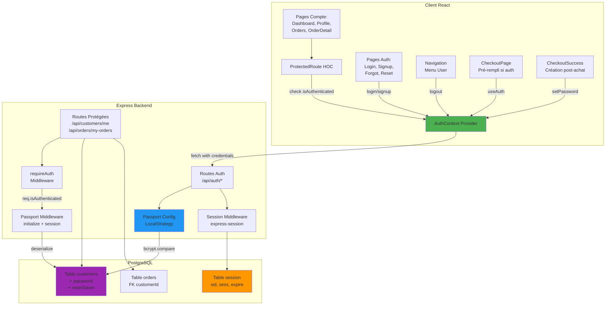

---

## 2. Flux Authentification Détaillé

### Flux Signup (Inscription)

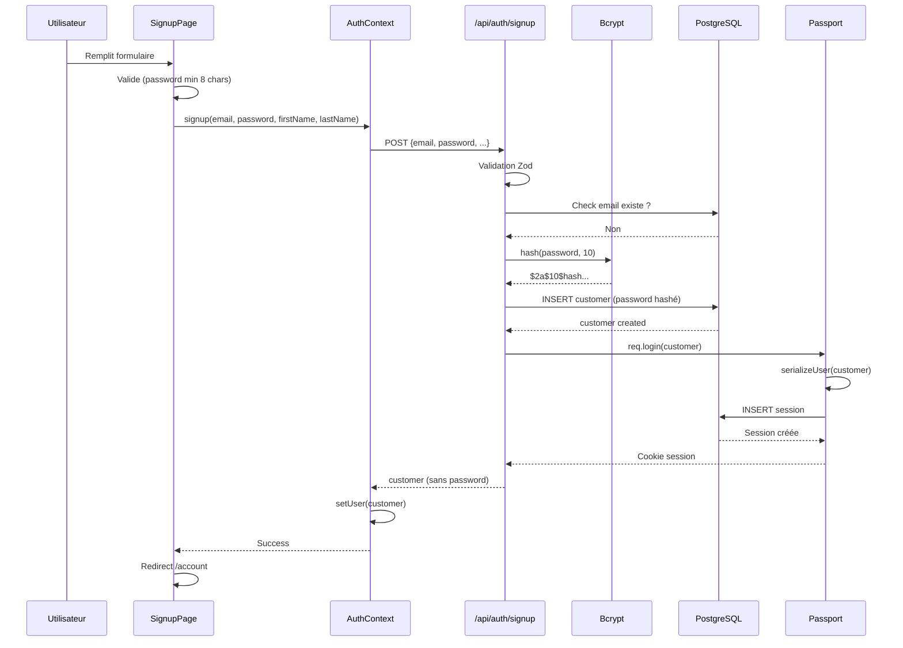

### Flux Login (Connexion)

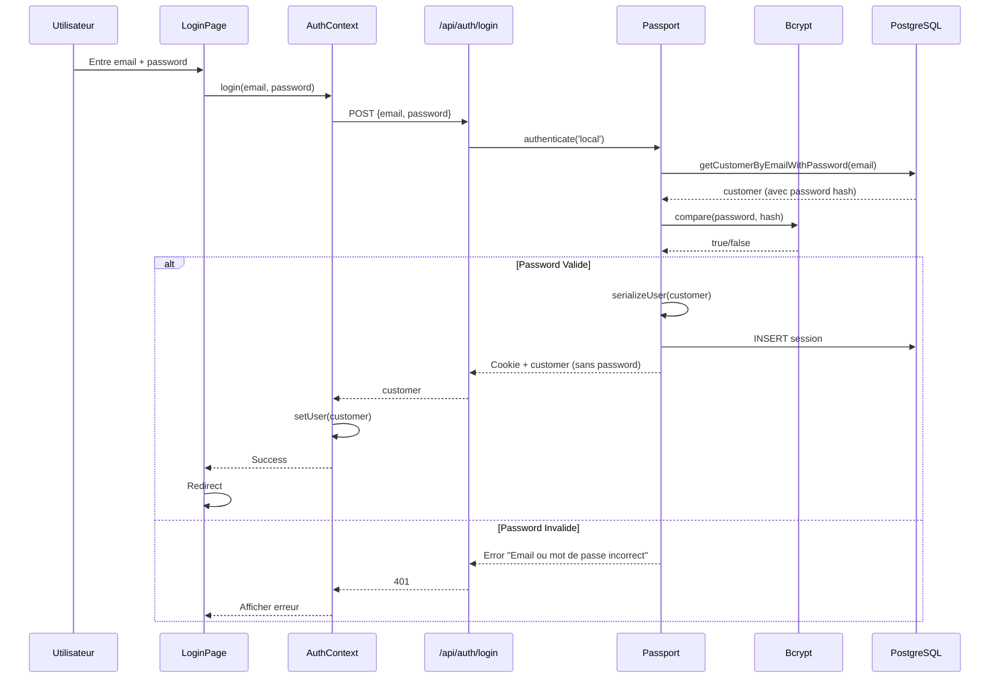

### Flux Requête Protégée

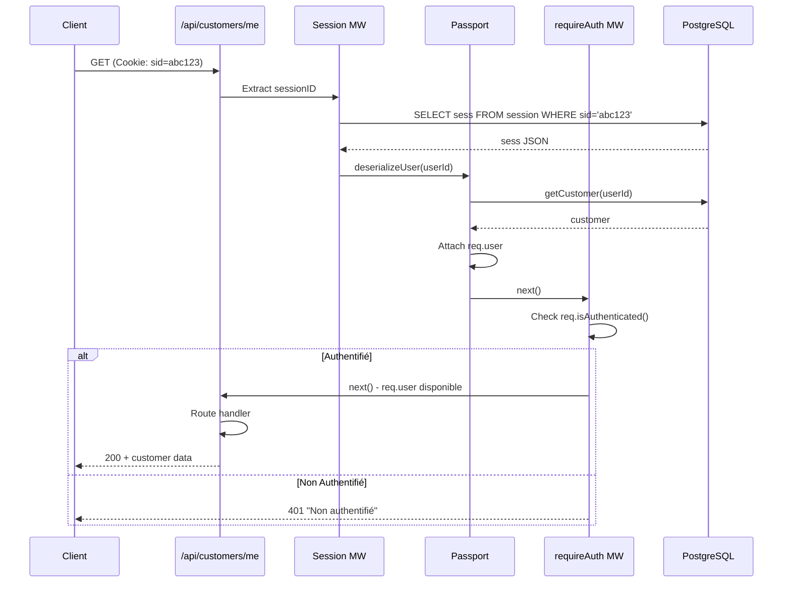

---

## 3. Flux Mot de Passe Oublié

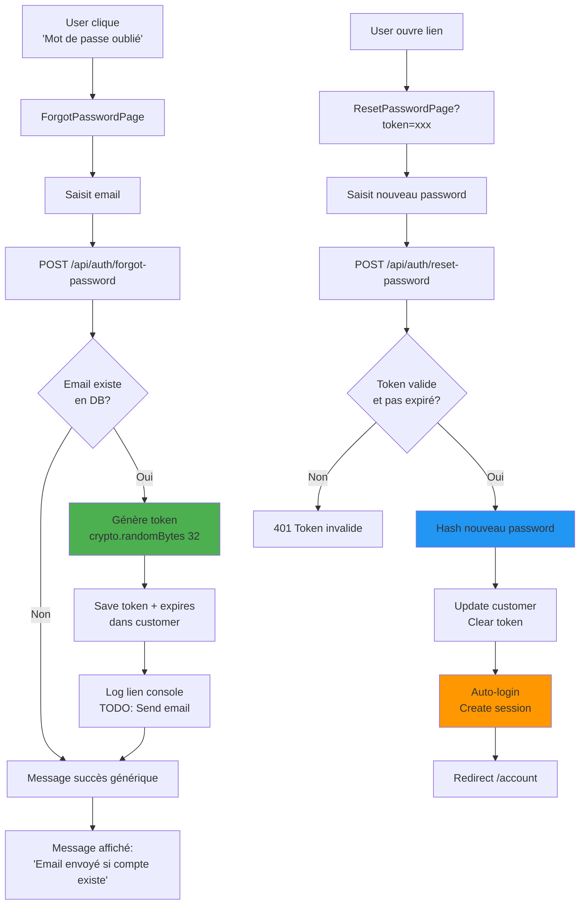

---

## 4. Flux Création Compte Post-Achat (Best Practice)

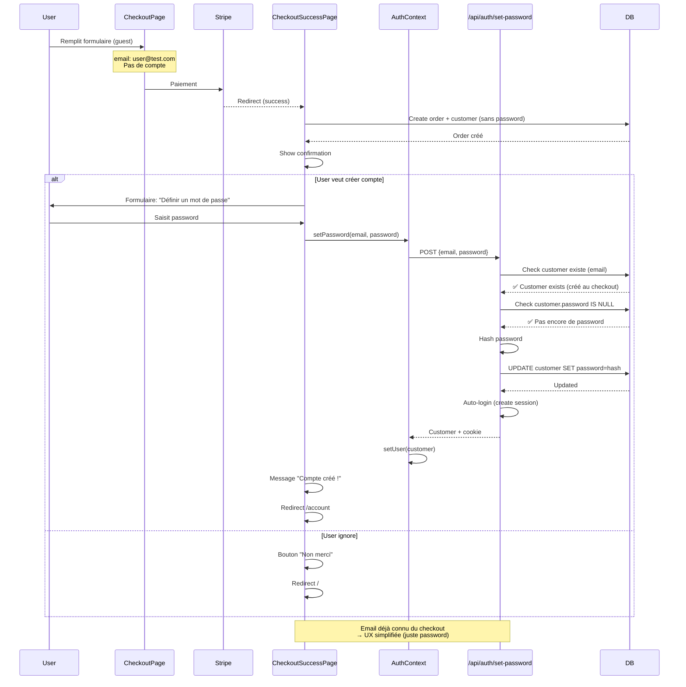

---

## 5. État AuthContext (Frontend)

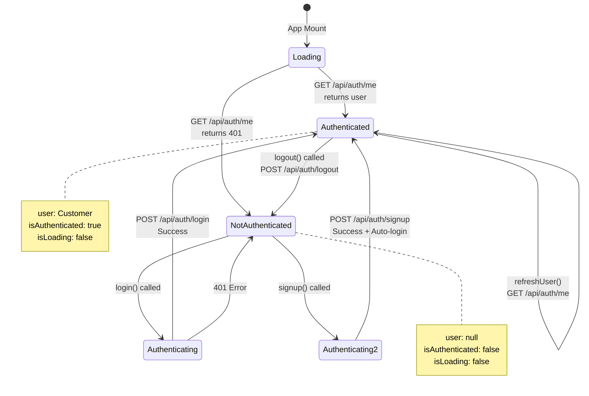

---

## 6. Schéma Base de Données Complet

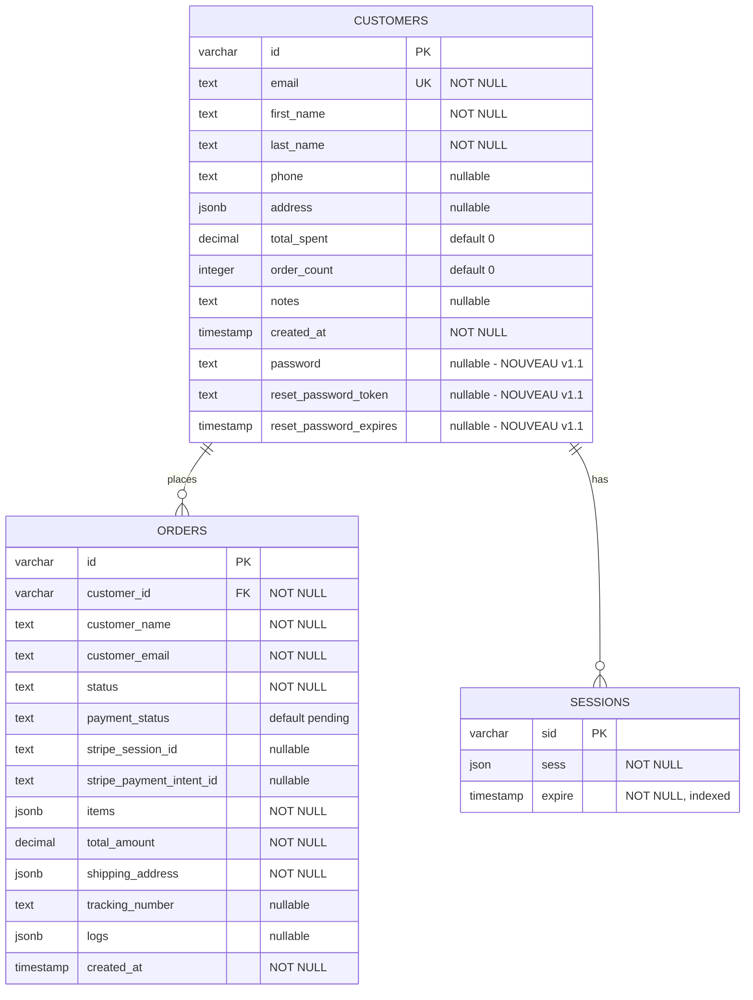

---

## 7. Flux Checkout Intelligent (Auth vs Guest)

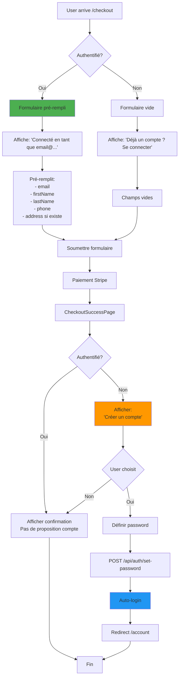

---

## 8. Hiérarchie Contextes React

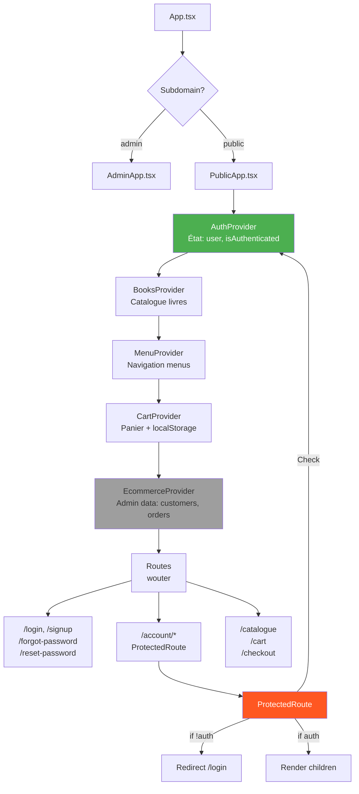

**Note:** `EcommerceProvider` charge customers/orders pour AdminDashboard. Les clients connectés utilisent les routes `/me` et `/my-orders` directement.

---

## 9. Cycle de Vie Session

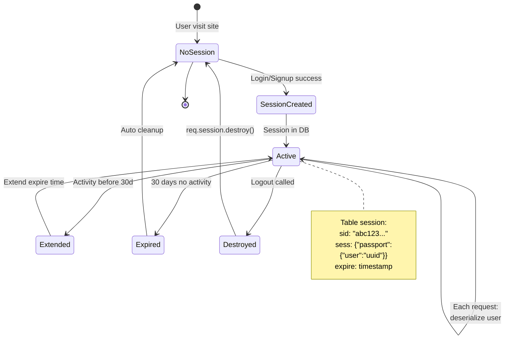

---

## 10. Password Security Flow

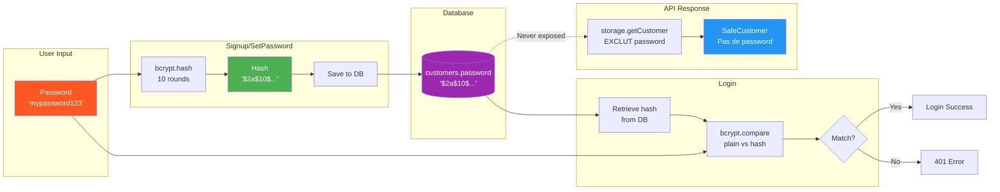

---

## 11. Routes et Protection

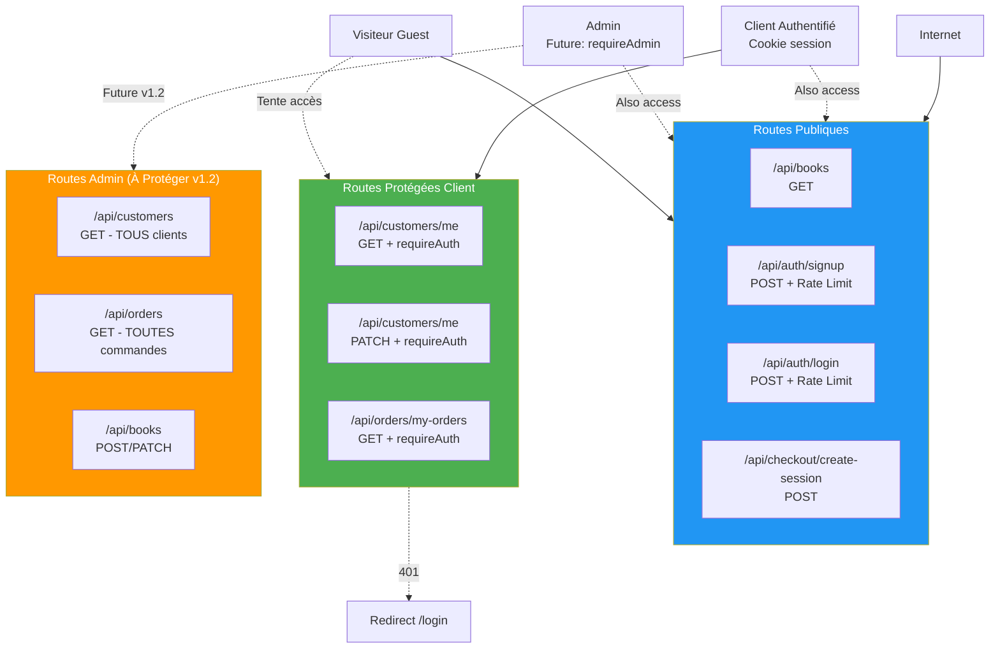

---

## 12. Flux Données AuthContext

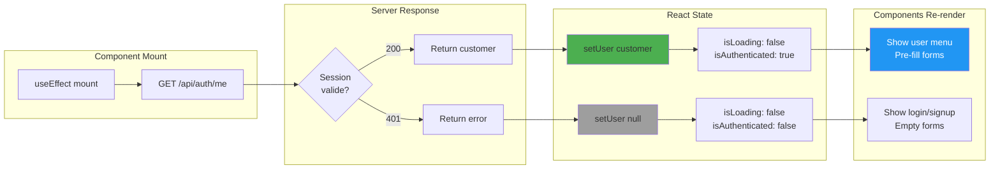

---

## 13. Navigation Conditionnelle

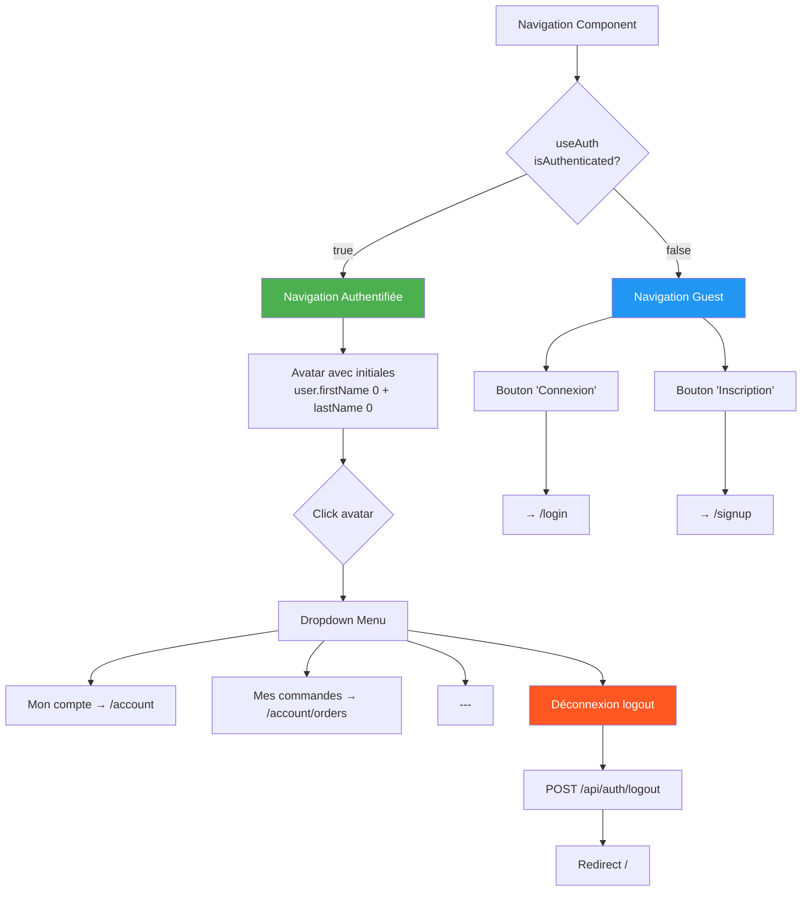

---

## 14. Pages Protection Flow

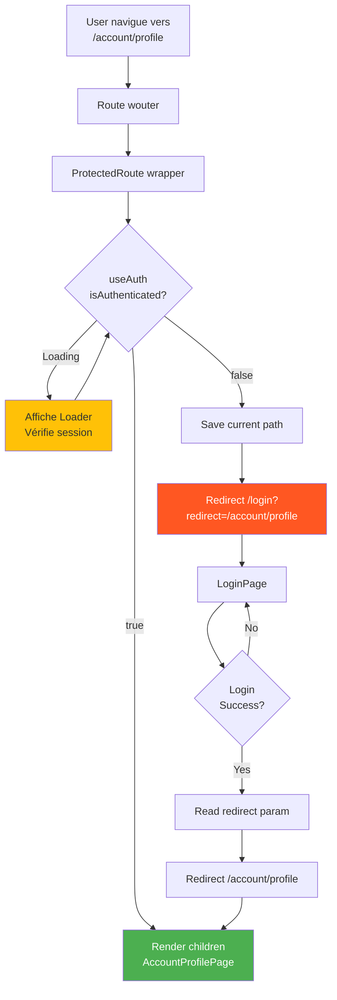

---

## 15. Architecture Complète (Zoom Out)

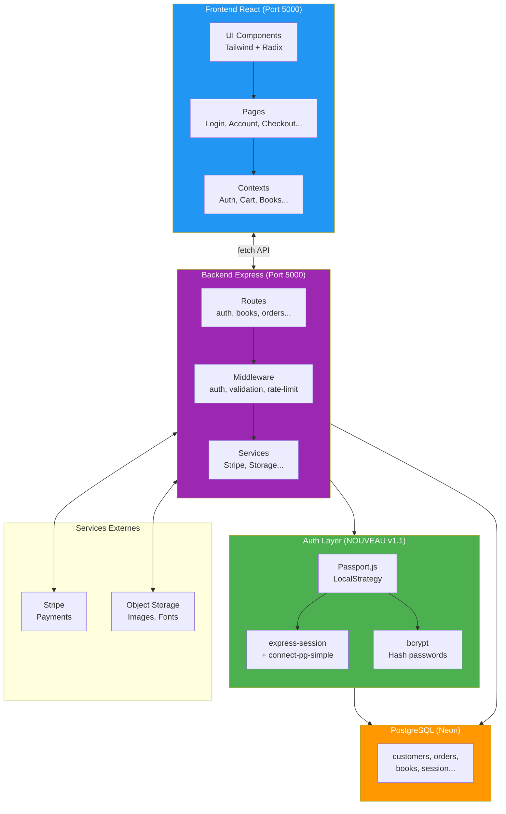

---

## 📚 Légende des Couleurs

- 🟢 **Vert** - Authentification / Sécurité
- 🔵 **Bleu** - Frontend / UI
- 🟣 **Violet** - Backend / API
- 🟠 **Orange** - Base de Données / Stockage
- 🔴 **Rouge** - Actions destructives / Erreurs
- ⚪ **Gris** - État inactif / Non utilisé

---

**Pour documentation textuelle complète:** [AUTHENTICATION_SYSTEM.md](AUTHENTICATION_SYSTEM.md)  
**Pour guide rapide:** [QUICKSTART_AUTH.md](QUICKSTART_AUTH.md)  
**Pour index navigation:** [DOCS_INDEX.md](DOCS_INDEX.md)
