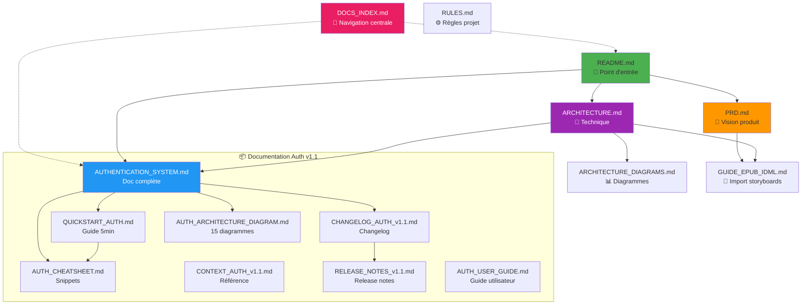

# Index de la Documentation - NuageBook

**Dernière mise à jour:** 29 Janvier 2026  
**Version:** 1.1.0

Ce document centralise toute la documentation du projet pour ne jamais perdre le contexte.

---

## 📚 Documentation Principale

### Vue d'Ensemble

| Document | Quand l'utiliser | Contenu Principal |
|----------|------------------|-------------------|
| **[README.md](README.md)** | Point d'entrée du projet | Installation, quick start, stack, scripts |
| **[PRD.md](PRD.md)** | Comprendre la vision produit | Fonctionnalités, user stories, roadmap, métriques |
| **[ARCHITECTURE.md](ARCHITECTURE.md)** | Architecture technique complète | Stack détaillé, patterns, flux métier, state management |
| **[ARCHITECTURE_DIAGRAMS.md](ARCHITECTURE_DIAGRAMS.md)** | Visualiser l'architecture | Diagrammes Mermaid (import EPUB, checkout, rendering) |

### Guides Spécialisés

| Document | Sujet | Utilité |
|----------|-------|---------|
| **[GUIDE_EPUB_IDML.md](GUIDE_EPUB_IDML.md)** | Import storyboards | Règle d'or EPUB/IDML, parsing, fusion, polices |
| **[AUTHENTICATION_SYSTEM.md](AUTHENTICATION_SYSTEM.md)** | Système d'authentification | Routes API, sécurité, tests, best practices |
| **[QUICKSTART_AUTH.md](QUICKSTART_AUTH.md)** | Démarrage rapide auth | Guide 5 minutes, patterns, debugging |
| **[CHANGELOG_AUTH_v1.1.md](CHANGELOG_AUTH_v1.1.md)** | Changelog authentification | Détails implémentation v1.1, métriques, flux |
| **[RULES.md](RULES.md)** | Règles du projet | Processus confirmation, standards code |

---

## 🗂️ Par Thématique

### 🔐 Authentification (v1.1 - NOUVEAU)

**Documents (8 fichiers - 2,660 lignes):**

| Document | Lignes | Pour Qui | Usage |
|----------|--------|----------|-------|
| **[AUTHENTICATION_SYSTEM.md](AUTHENTICATION_SYSTEM.md)** | 280 | Devs | Doc technique complète |
| **[QUICKSTART_AUTH.md](QUICKSTART_AUTH.md)** | 380 | Devs | Setup en 5 minutes |
| **[CHANGELOG_AUTH_v1.1.md](CHANGELOG_AUTH_v1.1.md)** | 530 | Tous | Détails changements |
| **[AUTH_ARCHITECTURE_DIAGRAM.md](AUTH_ARCHITECTURE_DIAGRAM.md)** | 450 | Tous | 15 diagrammes Mermaid |
| **[AUTH_CHEATSHEET.md](AUTH_CHEATSHEET.md)** | 180 | Devs | Snippets code |
| **[CONTEXT_AUTH_v1.1.md](CONTEXT_AUTH_v1.1.md)** | 240 | Devs | Référence rapide |
| **[RELEASE_NOTES_v1.1.md](RELEASE_NOTES_v1.1.md)** | 480 | Tous | Notes release officielle |
| **[AUTH_USER_GUIDE.md](AUTH_USER_GUIDE.md)** | 120 | Users/Support | Guide utilisateur final |

**Sections dans docs existantes:**
- [README.md](README.md) - Section "Variables d'Environnement" (SESSION_SECRET)
- [ARCHITECTURE.md](ARCHITECTURE.md) - Section "Système d'Authentification Client"
- [PRD.md](PRD.md) - Section 2.4 "Comptes Clients et Authentification"

**Fichiers Code Clés:**
```
Backend:
- server/config/passport.ts          (Configuration Passport.js)
- server/middleware/auth.ts          (requireAuth middleware)
- server/routes/auth.routes.ts       (7 routes auth)
- server/types/express.d.ts          (Types req.user)

Frontend:
- client/src/context/AuthContext.tsx (État global auth)
- client/src/components/ProtectedRoute.tsx
- client/src/pages/LoginPage.tsx
- client/src/pages/AccountPage.tsx
```

### 📦 Import EPUB/IDML

**Documents:**
1. **[GUIDE_EPUB_IDML.md](GUIDE_EPUB_IDML.md)** - Guide complet
2. [server/services/object_storage/README.md](server/services/object_storage/README.md) - README module
3. [server/services/object_storage/IDML_IMPORT.md](server/services/object_storage/IDML_IMPORT.md) - Détails techniques

**Documents Connexes:**
- [CONDITIONAL_TEXT_IMPLEMENTATION.md](CONDITIONAL_TEXT_IMPLEMENTATION.md)
- [server/services/object_storage/VARIABLE_MAPPING.md](server/services/object_storage/VARIABLE_MAPPING.md)
- [server/services/object_storage/PARSER_IMPROVEMENTS.md](server/services/object_storage/PARSER_IMPROVEMENTS.md)

**Fichiers Code:**
```
- server/services/object_storage/epubExtractor.ts
- server/services/object_storage/idmlParser.ts
- server/services/object_storage/idmlMerger.ts
- server/services/object_storage/wizardConfigBuilder.ts
```

### 🎨 Wizard & Personnalisation

**Sections dans docs:**
- [PRD.md](PRD.md) - Section 2.2 "Wizard de Personnalisation"
- [ARCHITECTURE.md](ARCHITECTURE.md) - Section "Flux Personnalisation"
- [ARCHITECTURE_DIAGRAMS.md](ARCHITECTURE_DIAGRAMS.md) - Diagramme Flux Wizard

**Fichiers Code:**
```
- client/src/components/Wizard.tsx       (Wizard principal)
- client/src/components/BookPreview.tsx  (Preview + génération)
- client/src/apps/PublicApp.tsx          (State management)
```

### 🛒 Panier & Checkout

**Sections dans docs:**
- [PRD.md](PRD.md) - Section 2.6 "Panier et Checkout"
- [ARCHITECTURE.md](ARCHITECTURE.md) - Section "Flux Checkout"

**Fichiers Code:**
```
Frontend:
- client/src/context/CartContext.tsx     (État panier)
- client/src/pages/CartPage.tsx
- client/src/pages/CheckoutPage.tsx      (Modifié v1.1 - support auth)
- client/src/pages/CheckoutSuccessPage.tsx (Modifié v1.1 - création compte)

Backend:
- server/routes/checkout.routes.ts
- server/stripeService.ts
- server/webhookHandlers.ts
```

### 👨‍💼 Administration

**Sections dans docs:**
- [PRD.md](PRD.md) - Section 2.7 "Administration"
- [ARCHITECTURE.md](ARCHITECTURE.md) - Section "Admin Dashboard"

**Fichiers Code:**
```
- client/src/components/AdminDashboard.tsx (6700+ lignes - hub central)
- client/src/apps/AdminApp.tsx
- server/routes/*.routes.ts (toutes les routes admin)
```

---

## 🔍 Recherche par Besoin

### "Je veux comprendre..."

| Besoin | Document(s) | Section |
|--------|-------------|---------|
| **Comment fonctionne l'import IDML ?** | [GUIDE_EPUB_IDML.md](GUIDE_EPUB_IDML.md) | Toutes sections |
| **Pourquoi EPUB + IDML ?** | [GUIDE_EPUB_IDML.md](GUIDE_EPUB_IDML.md) | "Règle d'Or" |
| **Comment est généré le wizard ?** | [PRD.md](PRD.md) | Section 2.2 |
| **Comment fonctionnent les sessions ?** | [AUTHENTICATION_SYSTEM.md](AUTHENTICATION_SYSTEM.md) | Section "Architecture" |
| **Quelles sont les routes API ?** | [README.md](README.md) | Section "Endpoints API" |
| **Comment protéger une route ?** | [QUICKSTART_AUTH.md](QUICKSTART_AUTH.md) | Section "Patterns Utiles" |
| **Flux complet d'achat ?** | [ARCHITECTURE_DIAGRAMS.md](ARCHITECTURE_DIAGRAMS.md) | Diagramme Checkout |
| **Structure base de données ?** | [ARCHITECTURE_DIAGRAMS.md](ARCHITECTURE_DIAGRAMS.md) | ERD Schema |

### "Je veux faire..."

| Tâche | Document | Action |
|-------|----------|--------|
| **Ajouter une route protégée** | [QUICKSTART_AUTH.md](QUICKSTART_AUTH.md) | Voir "Protéger une Nouvelle Route" |
| **Importer un nouveau livre** | [GUIDE_EPUB_IDML.md](GUIDE_EPUB_IDML.md) | Suivre "Workflow Complet" |
| **Modifier le wizard** | [PRD.md](PRD.md) | Section 2.2 puis code Wizard.tsx |
| **Ajouter un moyen de paiement** | [PRD.md](PRD.md) | Section 2.6, puis stripeService.ts |
| **Créer une nouvelle page compte** | [QUICKSTART_AUTH.md](QUICKSTART_AUTH.md) | Pattern ProtectedRoute |
| **Tester l'authentification** | [AUTHENTICATION_SYSTEM.md](AUTHENTICATION_SYSTEM.md) | Section "Tests manuels" |

### "J'ai un problème avec..."

| Problème | Document | Section Debugging |
|----------|----------|------------------|
| **Import IDML échoue** | [GUIDE_EPUB_IDML.md](GUIDE_EPUB_IDML.md) | FAQ & Troubleshooting |
| **Polices pas appliquées** | [GUIDE_EPUB_IDML.md](GUIDE_EPUB_IDML.md) | Guide des Polices |
| **Login ne fonctionne pas** | [QUICKSTART_AUTH.md](QUICKSTART_AUTH.md) | Section "Debugging" |
| **Routes protégées retournent 401** | [QUICKSTART_AUTH.md](QUICKSTART_AUTH.md) | "Erreurs Courantes" |
| **Tests TypeScript échouent** | [ARCHITECTURE.md](ARCHITECTURE.md) | Section "Tests" |

---

## 📋 Checklist Onboarding Nouveau Développeur

### Jour 1: Comprendre le Projet

- [ ] Lire [README.md](README.md) - Vue d'ensemble
- [ ] Lire [PRD.md](PRD.md) - Sections 1 & 2.1-2.4
- [ ] Parcourir [ARCHITECTURE_DIAGRAMS.md](ARCHITECTURE_DIAGRAMS.md) - Voir les flux visuels
- [ ] Setup local: `npm install` + `.env` + `npm run db:push`
- [ ] Lancer `npm run dev` + tester sur localhost

### Jour 2: Authentification

- [ ] Lire [AUTHENTICATION_SYSTEM.md](AUTHENTICATION_SYSTEM.md)
- [ ] Suivre [QUICKSTART_AUTH.md](QUICKSTART_AUTH.md)
- [ ] Tester signup/login sur localhost
- [ ] Explorer code: AuthContext.tsx, passport.ts, auth.routes.ts
- [ ] Créer un compte test et faire un achat

### Jour 3: Import & Wizard

- [ ] Lire [GUIDE_EPUB_IDML.md](GUIDE_EPUB_IDML.md)
- [ ] Comprendre la règle d'or EPUB/IDML
- [ ] Explorer epubExtractor.ts, idmlParser.ts, idmlMerger.ts
- [ ] Tester import d'un livre via admin dashboard
- [ ] Observer génération wizard automatique

### Jour 4: Admin & Checkout

- [ ] Explorer AdminDashboard.tsx
- [ ] Tester création livre, gestion commandes
- [ ] Lire section Checkout dans [PRD.md](PRD.md)
- [ ] Tester checkout guest et checkout authentifié
- [ ] Observer intégration Stripe

### Jour 5: Contribution

- [ ] Lire [RULES.md](RULES.md)
- [ ] Faire premier commit (petit fix ou doc)
- [ ] Review d'un PR existant
- [ ] Identifier une amélioration potentielle

---

## 🔄 Cycle de Vie Documentation

### Quand Mettre à Jour

**README.md** - À chaque feature majeure ou changement stack  
**ARCHITECTURE.md** - Changements architecture, nouveaux patterns  
**PRD.md** - Nouvelles fonctionnalités, modification roadmap  
**CHANGELOG_*.md** - À chaque release  
**GUIDE_*.md** - Nouveaux guides spécialisés si besoin

### Template Nouveau Feature

```markdown
# [NOM_FEATURE].md

**Version:** X.Y.Z
**Date:** YYYY-MM-DD

## Vue d'ensemble
[Description 2-3 phrases]

## Fonctionnalités
- Fonctionnalité 1
- Fonctionnalité 2

## Architecture
[Diagramme si pertinent]

## Fichiers Modifiés
[Liste avec description]

## Configuration Requise
[Variables env, migrations DB]

## Tests
[Guide de test]

## Prochaines Étapes
[Améliorations futures]
```

---

## 🎯 Documentation par Rôle

### Développeur Backend

**Must Read:**
1. [ARCHITECTURE.md](ARCHITECTURE.md) - Stack backend complet
2. [AUTHENTICATION_SYSTEM.md](AUTHENTICATION_SYSTEM.md) - Si travail sur auth
3. [GUIDE_EPUB_IDML.md](GUIDE_EPUB_IDML.md) - Si travail sur import

**Code Important:**
- `server/storage.ts` - Couche données
- `server/routes/*.routes.ts` - Toutes les routes
- `shared/schema.ts` - Schémas DB et validation

### Développeur Frontend

**Must Read:**
1. [README.md](README.md) - Quick start
2. [PRD.md](PRD.md) - UX et fonctionnalités
3. [QUICKSTART_AUTH.md](QUICKSTART_AUTH.md) - Si travail sur auth

**Code Important:**
- `client/src/apps/PublicApp.tsx` - Routing principal
- `client/src/context/*.tsx` - State management
- `client/src/components/Wizard.tsx` - Composant central

### Product Manager

**Must Read:**
1. [PRD.md](PRD.md) - Complet
2. [ARCHITECTURE_DIAGRAMS.md](ARCHITECTURE_DIAGRAMS.md) - Flux visuels
3. [CHANGELOG_AUTH_v1.1.md](CHANGELOG_AUTH_v1.1.md) - Dernières features

### DevOps / SRE

**Must Read:**
1. [ARCHITECTURE.md](ARCHITECTURE.md) - Infrastructure
2. [README.md](README.md) - Scripts et déploiement
3. [AUTHENTICATION_SYSTEM.md](AUTHENTICATION_SYSTEM.md) - Variables env

**Config Important:**
- `server/config/env.ts` - Validation env
- `.github/workflows/ci.yml` - Pipeline CI
- `drizzle.config.ts` - Migrations DB

---

## 📊 Versions et Historique

### v1.1.0 (29 Janvier 2026)

**Features:**
- ✅ Système d'authentification complet
- ✅ Espace client avec historique commandes
- ✅ Création compte post-achat
- ✅ Mot de passe oublié / reset

**Documentation Créée:**
- AUTHENTICATION_SYSTEM.md
- QUICKSTART_AUTH.md
- CHANGELOG_AUTH_v1.1.md
- DOCS_INDEX.md (ce fichier)

**Documentation Mise à Jour:**
- README.md (endpoints, env vars, version)
- ARCHITECTURE.md (stack auth, state management, endpoints)
- PRD.md (section 2.4, roadmap phase 2)

### v1.0.0 (Janvier 2026)

**Features:**
- ✅ Catalogue livres
- ✅ Wizard personnalisation
- ✅ Import EPUB/IDML
- ✅ Preview flipbook
- ✅ Panier & checkout Stripe
- ✅ Admin dashboard

**Documentation:**
- README.md
- PRD.md
- ARCHITECTURE.md
- ARCHITECTURE_DIAGRAMS.md
- GUIDE_EPUB_IDML.md
- RULES.md

---

## 🗺️ Carte des Dépendances Documentation



---

## 🔧 Maintenance Documentation

### Règles d'Or

1. **Toujours mettre à jour README.md** quand feature majeure
2. **Créer CHANGELOG_*.md** pour chaque version
3. **Maintenir DOCS_INDEX.md** à jour (ce fichier)
4. **Diagrammes Mermaid** plutôt que images (versionnables)
5. **Exemples de code** toujours testés

### Commandes Utiles

```bash
# Compter lignes de documentation
find . -name "*.md" -not -path "./.cache/*" -not -path "./node_modules/*" | xargs wc -l

# Rechercher dans toute la doc
grep -r "authentification" *.md

# Lister tous les MD à la racine
ls -1 *.md
```

### Checklist PR Documentation

- [ ] README.md mis à jour si feature publique
- [ ] ARCHITECTURE.md mis à jour si changement technique
- [ ] Nouveau CHANGELOG_*.md si version release
- [ ] DOCS_INDEX.md mis à jour si nouveau doc
- [ ] Diagrammes Mermaid ajoutés si pertinent
- [ ] Exemples de code testés

---

## 📖 Glossaire Rapide

| Terme | Définition | Doc Référence |
|-------|------------|---------------|
| **EPUB** | Format ebook avec positions éléments | [GUIDE_EPUB_IDML.md](GUIDE_EPUB_IDML.md) |
| **IDML** | Format InDesign avec textes et styles | [GUIDE_EPUB_IDML.md](GUIDE_EPUB_IDML.md) |
| **Wizard** | Interface multi-étapes personnalisation | [PRD.md](PRD.md) Section 2.2 |
| **contentConfig** | JSON fusion EPUB+IDML | [GUIDE_EPUB_IDML.md](GUIDE_EPUB_IDML.md) |
| **wizardConfig** | Configuration générée pour wizard | [PRD.md](PRD.md) Section 2.2 |
| **Flipbook** | Effet page tournante (flipbook-js) | [PRD.md](PRD.md) Section 2.5 |
| **Guest Checkout** | Achat sans compte | [AUTHENTICATION_SYSTEM.md](AUTHENTICATION_SYSTEM.md) |
| **SafeCustomer** | Customer sans password | [AUTHENTICATION_SYSTEM.md](AUTHENTICATION_SYSTEM.md) |
| **requireAuth** | Middleware protection routes | [QUICKSTART_AUTH.md](QUICKSTART_AUTH.md) |

---

## 🚀 Liens Rapides Développement

### Serveur Local

- **Frontend:** http://localhost:5000
- **Admin:** http://localhost:5000/admin
- **Health Check:** http://localhost:5000/health
- **API Docs:** (À venir - Swagger)

### Commandes Fréquentes

```bash
# Développement
npm run dev                          # Backend
npm run dev:client                   # Frontend (si séparé)

# Base de données
npm run db:push                      # Migration schema
tsx server/scripts/clean-old-customers.ts  # Reset données auth

# Tests
npm test                             # Tous les tests
npm run check                        # TypeScript check

# Build
npm run build                        # Production build
npm start                            # Démarrer production
```

### Logs Importants

```bash
# Session configurée
[INFO]: Session and authentication middleware configured

# Routes enregistrées
[INFO]: All routes registered

# Stripe prêt
[INFO]: Stripe schema ready

# Erreur auth
[WARN]: Unauthorized access attempt (path: "/api/customers/me")
```

---

## 🌟 Best Practices Documentation

### ✅ Bonnes Pratiques

- **Diagrammes Mermaid** pour tous les flux
- **Exemples de code** inline dans la doc
- **Liens internes** entre documents connexes
- **Tables comparatives** pour décisions techniques
- **Changelog** détaillé par version
- **Index centralisé** (ce fichier)

### ❌ À Éviter

- Images PNG/JPG (préférer Mermaid)
- Documentation code uniquement (aussi prose)
- Exemples non testés
- Liens morts
- Duplication entre docs

---

## 📞 Contacts & Support

### Questions Techniques

1. Chercher dans ce document
2. Lire la doc spécialisée
3. Explorer le code (bien commenté)
4. Créer une issue GitHub

### Contribuer à la Doc

1. Fork le repository
2. Modifier la documentation
3. Tester les exemples
4. Mettre à jour DOCS_INDEX.md
5. PR avec label `documentation`

---

**Ce document est la source de vérité pour naviguer dans toute la documentation du projet.**

**Maintenu par:** L'équipe NuageBook  
**Dernière review:** 29 Janvier 2026
